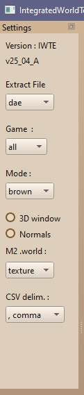
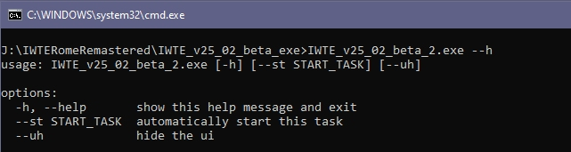

# IWTE 
### The documentation in this depository is still a work in progress - the information relates to IWTE_25_02_beta and later

Repository for the IWTE tool, developed by wilddog to enable modding of the Total War games, Medieval 2 Total War, Rome Total War and Rome Remastered.

Information in this repository relates to using IWTE in conjunction with [Blender](https://www.blender.org/).  Blender is a powerful and FREE 3d modelling program. Extract to dae/glb may also work with 3dsMax but problems with 3dsMax use are not supported by the IWTE team.  The original Milkshape (ms3d) options have been retained but are not generally detailed here.  If you are new to modding with IWTE we do not recommend using ms3d as it has size and other limitations.

## The latest version is IWTE_25_02_beta_2.exe available [here](https://www.dropbox.com/scl/fo/jefpt1m128hgh3fitevcg/ACYrgIpoy_wx9yxQeFG3DYI?rlkey=wnrkc3frs571krzxoxc13dlg6&e=2&st=mba2qjnz&dl=0).

The previous version IWTE_24_09_A  is still available [here](https://www.twcenter.net/forums/downloads.php?do=file&id=2741).

#### Table of Contents
* [Functions for M2TW](#Functions-for-M2TW)
* [Functions for RTW and Rome Remastered](#Functions-for-RTW-and-Rome-Remastered)
* [Functions for Rome Remastered Only](#Functions-for-Rome-Remastered-Only)
* [Task File Processes](#Task-File-Processes)
* [Preferences](#preferences)
* [Launching and Error Reporting](#Launching-and-Error-Reporting)
* [About IWTE](#About-IWTE)
* [License](#License)

#### See also
* [Tutorials and links](documentation/tutorials_and_links.md)
* IWTE section on [TWC WIKI](https://wiki.twcenter.net/index.php?title=IWTE)
* IWTE project section on [TWC Forum](https://www.twcenter.net/forums/forumdisplay.php?2047-The-IWTE-Project)

## Functions For M2TW
The following list is a quick round-up of IWTE's current capabilities for M2TW:
* Battlemap Settlements - [M2TW Settlement Modding](documentation/M2_Settlement_Modding.md) Using IWTE and Blender you can completely change the settlement layout, models, textures, effects and lighting.  Parts of the process include:
  * Editing [.worldpkgdesc](documentation/M2_worldpkgdesc.md) files - these control which .world is selected
  * Editing of .world, .worldcollision, .animinstances - these files inter-relate and are edited together, aspects include:
    * Changing models using Blender
    * Adding or deleting structures and complexes
    * Managing/resetting [complex blocks](documentation/M2_world_complex_blocks.md)
    * Adding effects and [resetting effects/lighting](documentation/M2_world_shading_and_lighting.md)
    * Making objects work as walls/towers/gates
    * Assigning objects to perimeters
    * Adding on [wall deployment blocks](documentation/M2_building_on_wall_deployment.md) and link/ladders
    * Adding/assigning collisions and assigning existing animations
    * [Editing and applying building animations](documentation/M2_building_animation_editing.md)
    * [Creating new building animations in Blender](documentation/M2_building_animations_in_Blender.md)
    * Adding 'bridges'
    * Changing the initial deployment area outline
    * Adding/changing plaza positions, techtree slots, road markers and defence points
  * Editing [.worldpathfinding](documentation/M2_worldpathfinding.md) - controls where troops can stand/travel
  * Editing [.worldvegetation](documentation/M2_worldvegetation.md) - controls where grass/trees/shrubs are shown around the settlement
  * Editing [.worldterrain](documentation/M2_worldterrain.md) - controls heights around settlement
  * Editing [Terrain Masks](documentation/M2_worldterrain_masks.md#m2-terrain-mask-editing) - masks can be edited shown at actual size in relation to settlement outline and terrain.
* Battlemap Environment
  * Editing [Descr_geography_new.db](documentation/geography_db.md).
  * Editing [vegetation.db](documentation/M2_vegetation_db.md)
  * Creating/amending [vegetation models](documentation/M2_vege_models.md)
  * Creating [vegetation sprites](documentation/M2_vege_sprites.md)
  * Editing [.lighting files](documentation/M2_battlemap_lighting.md)
  * Editing skydome mesh
* Battlemap - Mesh Models - Editing of [unit models](documentation/M2_unit_mesh.md) and banners. Editing of .mesh unit/siege models whilst merged to .cas skeleton and chained anims. Animation editing including use of animated bone_weapon groups. (via Blender/Max only)
* Battlemap Units - [battle_models.modeldb](documentation/M2_modeldb.md) - Error checking, re-formatting and editing function via conversion to csv file and back.
* Battlemap - [Model Traversable Network](documentation/M2_Model_Traversable_Network.md) - For siege ladders and towers, editing by conversion to .txt and back.
* Battlemap - [Texture Conversion](documentation/Image_Editing_and_Conversion.md#m2-texture-conversion-options) - Single file and directory level conversion of texture>dds>texture and tga>texture
* Campaign Map - [Strat Models (static)](documentation/strat_models.md) - Editing of residences, trees, resources in Milkshape/Blender/Max.
* Campaign Map - [Cas Texture Check CSV](documentation/cas_checking_tasks.md#cas_texture_csv) - Lists all texture names referenced by .cas files in selected directories in CSV format.
* Campaign Map - [Cas Data Check CSV](documentation/cas_checking_tasks.md#cas_data_csv) - Lists cas data including verts/tris count.  
* Campaign Map - Strat Models (characters) - Editing of animated character .cas models in Milkshape/Blender/Max. Includes the ability to chain animations together, edit and save back to separate anims.
* Campaign Map - [Strat Map Base .tga Editing](documentation/strat_map_base_file_editing.md) - Supports simple editing of the stratmap TGA and HGT files with files shown at correct relative sizes. Shows a 3d view of the strat map being edited and selection of colour schemes for the heights map.
* Misc - [Basic Image Editing](/documentation/Image_Editing_and_Conversion.md#basic-image-editing) - a simple painting process to open and edit various image file types including M2 .texture files.

## Functions For RTW and Rome Remastered
The following list is a quick round-up of IWTE's current capabilities for RTW (including BI and Alexander) and [Rome Total War Remastered.](https://github.com/FeralInteractive/romeremastered).

* Campaign Map - [Strat Map Base .tga Editing](documentation/strat_map_base_file_editing.md) - Supports simple editing of the stratmap TGA and HGT files with files shown at correct relative sizes. Shows a 3d view of the strat map being edited and selection of colour schemes for the heights map.
* Campaign Map - [Strat Models (static)](documentation/strat_models.md) -Editing of residences, trees, resources in Milkshape/Blender/Max.
* Units and Strat Figures - Editing of .cas files with a bone structure and weighting.
* Skeletons and Animations - Allows editing of animations, including in 'chained' format to view and edit multiple animations together.
* Battlemap Settlements - [.items to .cas conversions](documentation/battlemap_settlements_RR_and_RTW.md#item-to-cas-conversion-with-iwte) - (useful if .cas files were not supplied with mod). 
* Battlemap Settlements - [settlement plan editing options](documentation/battlemap_settlements_RR_and_RTW.md#settlement-plan-editing-with-iwte) - Includes a 2d window option to edit plans including wall layouts and a conversion to 3d option to allow editing in Blender.
* Battlemap Settlements - [Cas collision Check CSV](documentation/cas_checking_tasks.md#cas_collision_csv) - Enables checking for correct names and flatness of 'collision' meshes in info files.
* Battlemap Environment - Allows read/edit of [descr_geography.db](documentation/geography_db.md)
* Misc - [Cas Texture Check CSV](documentation/cas_checking_tasks.md#cas_texture_csv) - Lists all texture names referenced by .cas files in selected directories in CSV format.
* Misc - [Cas Data Check CSV](documentation/cas_checking_tasks.md#cas_data_csv) - Lists cas data including verts/tris count and numbers and types of meshes.
* Misc - [Basic Image Editing](/documentation/Image_Editing_and_Conversion.md#basic-image-editing) - A simple painting process to open and edit various image file types including M2 .texture files.

## Functions for Rome Remastered Only

* Campaign Map - 3d Map Mesh Production including Textures, see:
  * [RR_map_mesh_simple_method.md](documentation/RR_map_mesh_simple_method.md) - Creates 3d mesh and vanilla style textures from map_*.tga files without task file
  * [RR_map_mesh_production.md](documentation/RR_map_mesh_production.md) - Overview of the RR campaign map and details of options for the latest version of the mesh generation process
  * [RR_map_mesh_rivers.md](documentation/RR_map_mesh_rivers.md) - Explains how to overcome problems with river_mesh limit.
  * [RR_map_mesh_versions.md](documentation/RR_map_mesh_versions.md) - For differences between versions and details of the original mesh generation process.
* Campaign Map - [Creating Feral 2d Map](documentation/RR_map_mesh_create_feral_map.md) - Generates a large tga view from the map mesh and textures produced by the map mesh creation process.
* Units and Strat Figures - [Character Extraction](documentation/RR_Character_Extraction.md) - Extracts and converts .cas files for battlemap units and campaign map figures from Rome Remastered .pak files.
* Units and Strat Figures - [RR Skeletons and Animations](documentation/RR_Skeletons_and_Animations.md) - Unpacks/packs Rome Remastered skeletons and animations and provides skeleton to text and back option.
* Units and Strat Figures - [New skeleton from model](documentation/RR_units_new_skeleton_from_model.md) - Creates new skeleton and set of anims from edited unit model.
* Misc - [dds Conversion](documentation/Image_Editing_and_Conversion.md#rr-dds-lz4-compression-conversion-options) - Decompresses dds image files that use LZ4 compression, also applies LZ4 compression

  
## Task File Processes
Many processes undertaken by IWTE are accessible and/or easier to use via the task file process.  The process is initiated by selecting a task file from the button shown below.

For further information see [Task File Overview.md](documentation/Task_File_Overview.md)

## Preferences
As from 2025 versions certain preferences can be set and stored.

The Settings side bar can be un-docked and moved.  Settings and some frequently used paths will be stored in iwte_settings.txt in the IWTE folder.

Options accessed from the settings tab drop-down buttons are:
* Extract File\
dae, glb, or ms3d - the selected type will be used as default for cas to extract and mesh to extract processes, please note that some conversions are not possible to ms3d due to file format limits.  Glb files can be used in Blender 4+ where support for dae has been withdrawn.
* Game\
all, m2, rr or rtw - select a specific game if you wish to tidy the appearance of IWTE by removing game related functions you don't need
* Mode\
dark or brown - brown is close to the light brown appearance of the pre 2025 IWTE versions

The 3D window settings relate primarily to viewing M2TW .world settlements.  Normals can also be switched on/off when viewing .cas and .mesh models.

## Launching and Error Reporting
Please launch IWTE using a .bat file, the bat file should be in the same folder as the IWTE.exe and have content:

    IWTE_v25_02_beta.exe
    cmd /k
The top line should be the name of your current IWTE.exe.  

From 25_02_beta_2 IWTE allows some functions to be added to the .bat/cmd line:  

* --h  gives help menu
* --st  automatically starts the task listed after it on launch
* --uh  hides the ui NB: use only if you want IWTE to run the task specified at --st and then close

      IWTE_v25_02_beta_2.exe --st /iwte_tasks/open_world_stone_fort_D_task.txt
The above command would launch IWTE and run the task *open_world_stone_fort_D_task.txt* file located in your */iwte_tasks* folder

Launching via the .bat file will allow the command window to stay open in the event of an error occurring.  Some errors are also reported via IWTE's pop-up window as in the picture below.

The pop-up window allows you to show/hide details, although it will normally be easier to read information in the command window.  If your error is simple e.g. a file not found issue from a task file, you can click 'ignore', fix the file reference and run the task again.  For more complex problems make a copy or screenshot of the error message and click 'close' to shut IWTE.

Useful information will normally be found just before the 'Traceback' part of the error message, and just after the Files listed in the Traceback.

# About IWTE
IWTE stands for Integrated World Terrain Editor, the tool is developed and maintained by **wilddog**. It has been the major tool used for modifying battlemap buildings and environments in M2TW.  It has been expanded in recent years to aid unit/animation editing and provide a map mesh creation function for Rome Remastered. **Makanyane** has been the main tester and documentation writer (and still knows very little about programming!).

The tool's early development for M2TW settlements was based partly on prior research and development by **Argantonio** and **KnightErrant**. We'd extend special thanks to KnightErrant whose code and advice was used as the initial basis for the tool.

IWTE was created for use with our own mod and is provided free of charge to help other modders. Use of the tool is entirely at your own risk.

The change log for IWTE can be viewed [here](documentation/IWTE_change_log.md).

# License
**IWTE disclaimer**  
IWTE IS PROVIDED "AS IS" AND ANY EXPRESS OR IMPLIED WARRANTIES, INCLUDING, BUT NOT LIMITED TO,
THE IMPLIED WARRANTIES OF MERCHANTABILITY AND FITNESS FOR A PARTICULAR PURPOSE ARE DISCLAIMED.

IWTE is a python based application which makes use of the following libraries. 
Please see the licence for each item for more detail (available on their respective web sites). :
Access to the software is obtained from their respective sites.
* Python     PSF
* Numpy      BSD-3
* Scipy      BSD-3
* PySide6    LGPLv3
* Lz4        BSD-3
* Pillow     HPND

The below executables can be called by IWTE. They are provided as is via Nvidia (see Nvidia_licence.pdf). You can obtain them from the Nvidia site.
* nvdtx.exe
* Readdxt.eve

The below executable can be called by IWTE. It is provided as is and is subject to the MIT licence. Newer versions can be obtained from the [microsoft github page](https://github.com/Microsoft/DirectXTex/wiki/Texconv).
It is used to handle certain texture conversions.
* Texconv.exe
