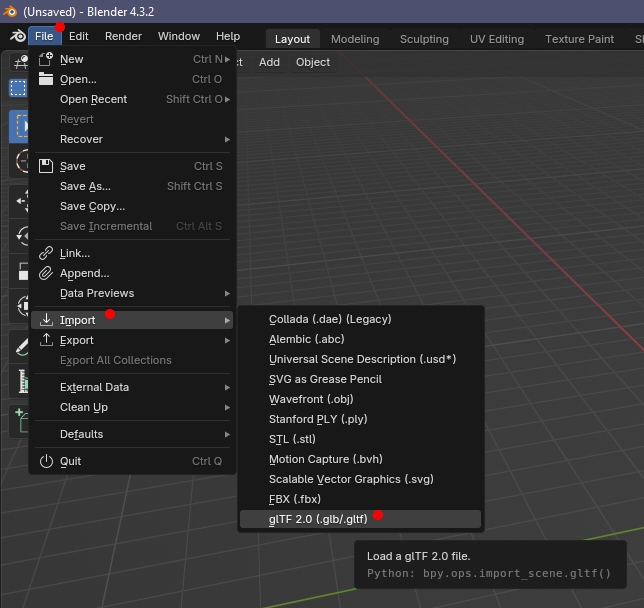
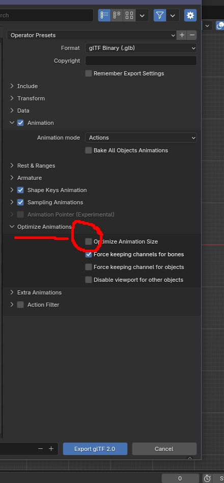
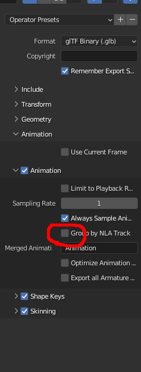

# Using Blender 4+ and .glb

The Collada/dae interface in Blender has now been marked as 'legacy' and support is ending.  IWTE has added functionality to extract Total War files to .glb instead of .dae.

.glb files are a sub-type of glTF2.0 to load into Blender use this import option:

If you don't see the glTF2.0 options you may need to activate the add-on see the [Blender manual](https://docs.blender.org/manual/en/latest/addons/import_export/scene_gltf2.html).

## For Animations

If exporting as .glb you need to untick the 'Optimize Animation Size' option.

Also do not use 'group by NLA track'.  

Please be aware that despite having a 'Remember Export Settings' button, Blender tends to forget...
