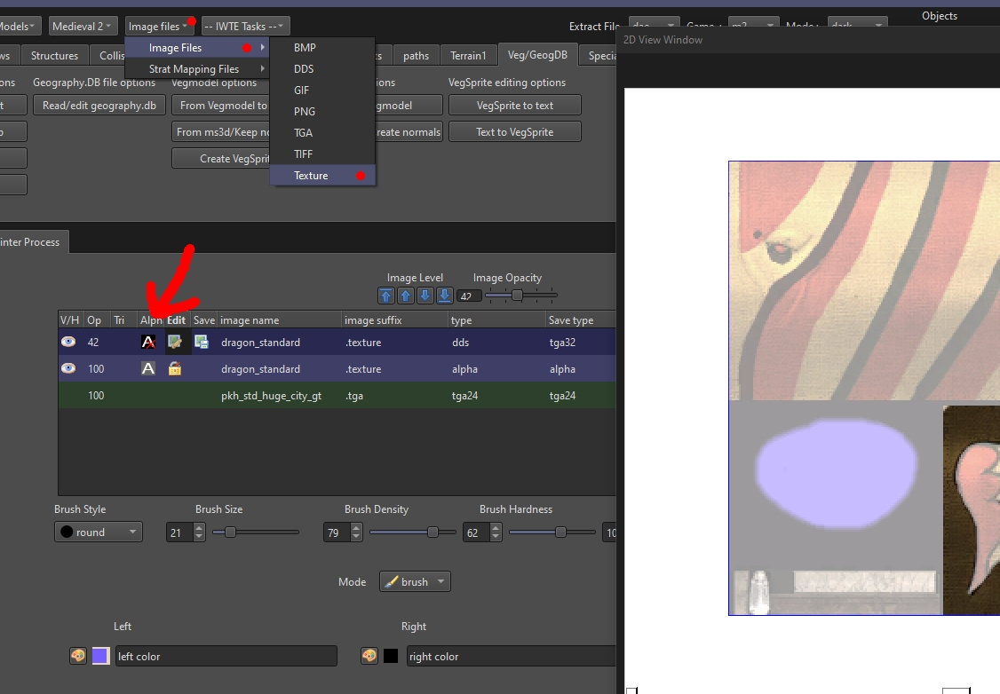
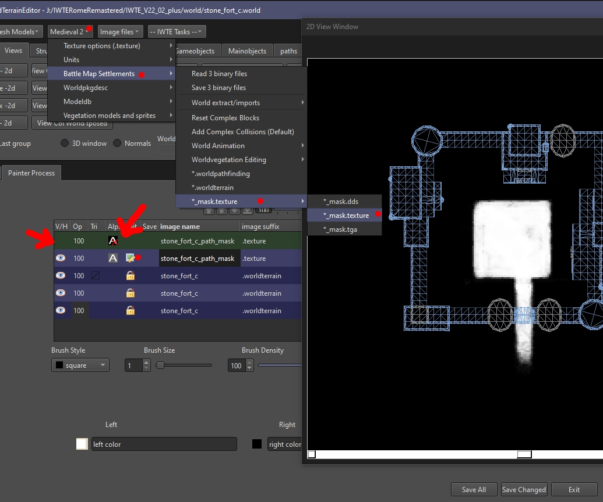
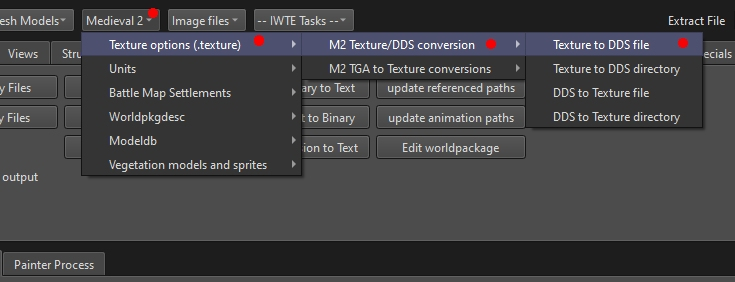
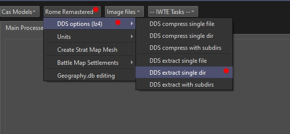

# IWTE Image Processing Functions

Whilst not primarily a graphics program IWTE has a variety of image editing/viewing/processing functions:
*  [Basic Image Editing](#Basic-Image-Editing) 
*  [M2 Terrain Mask Editing](#M2-Terrain-Mask-Editing)
*  [M2 Texture Conversion Options](#M2-Texture-Conversion-Options)
*  [RR dds LZ4 Compression Conversion Options](#rr-dds-lz4-compression-conversion-options)
*  [Strat Map tga/hgt Editing](strat_map_base_file_editing.md)

## Basic Image Editing

## M2 Terrain Mask Editing

Terrain mask editing is a special case of image editing.  You are required to load the settlement's .worldterrain file before loading the mask so the mask image can be stretched to the size it will appear in game.  You can then optionally also load the settlements 3 binary files and view the settlement outline relative to the mask.

## M2 Texture Conversion Options

## RR dds LZ4 Compression Conversion Options

