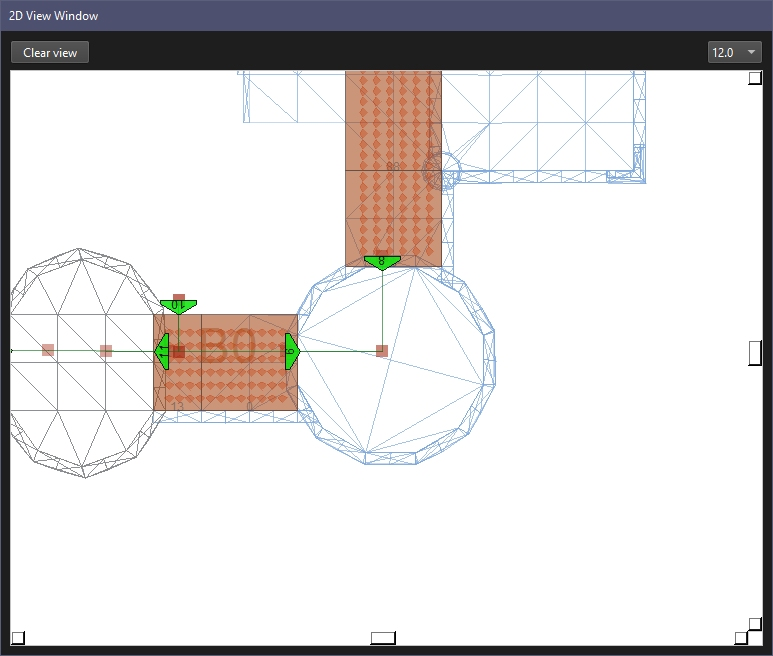

# M2TW Model Traversable Network Files

The M2TW .modeltraversablenetwork files are found in data/siege_engines. All seige engines have one but most are basically a null entry. Ladders and towers do use the file which sets the entry points for troops, paths to ascend/descend the engine, and platforms where they can stand on/in the engine.

IWTE provides a conversion process from the binary file to text and back.

To access these functions use the buttons:  
***Medieval 2 > Units > modeltraversablenetwork to text*** or ***text to modeltraversablenetwork***

Converting to text will get you two text files, the one titled *_edit.txt is designed to be ammended and read back by IWTE.  The other is a more exact representation of the binary file including pads counts and serialisation - you do not need this information, it is provided solely for research purposes (e.g. if someone else wanted to develop a tool to deal with this file type) 

The format of the file is very similar to the parts of the .world file that deal with on-wall deployment, 'doors', 'links and ladders'.  These can be viewed for settlement files but we do not have an equivalent viewing process for the modeltraversablenetwork files.

Makanyane has experimented with adjusting the file for siege ladders and found the process difficult, see https://youtu.be/5D0Jy9o2UBI, this attempt was better https://youtu.be/3lUVu4FmMMQ but still had issues, the attempt was ultimately abandoned.
