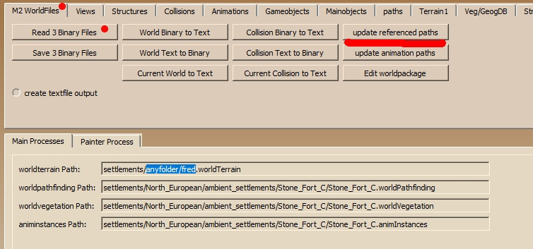
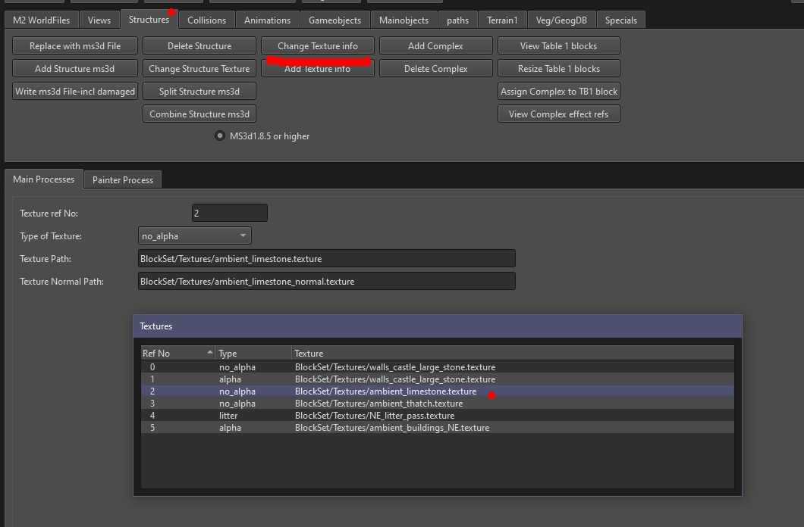
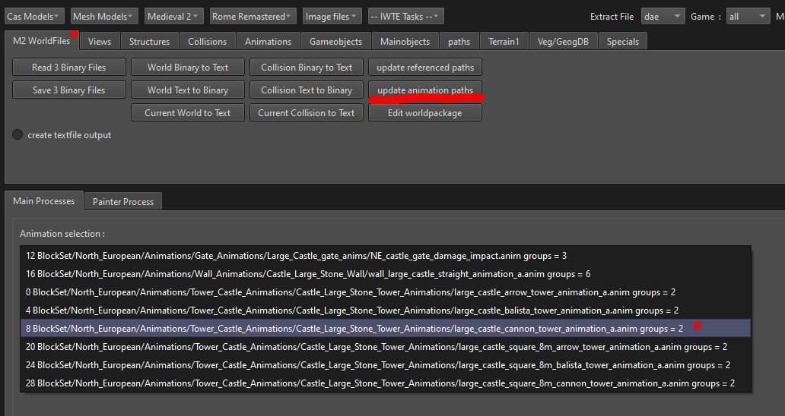
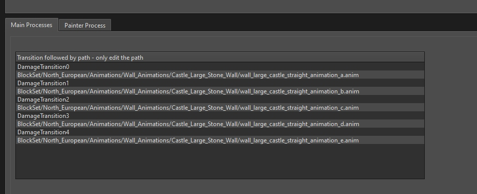
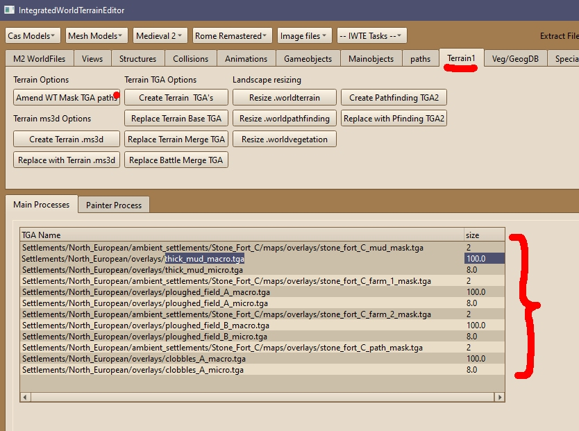

# M2TW Settlement Modding
Modding battlemap settlements in M2TW is a relatively complex task.  IWTE is the only currently maintained tool for this branch of modding.  Before launching into designing new settlements modders should aquire some understanding of the files involved and experiment with modifying existing settlements.

All buildings and some other objects that appear on M2TW battlemaps are loaded from .world files. 
Some information about the structure of the .world file is provided on [TWC Wiki](https://wiki.twcenter.net/index.php?title=.world_file_-_M2TW) (info for geeks only, not needed for modding).

.world files are used for:
* settlements
* techtrees inside settlements
* bridges
* ambient objects

## Loading Tree

* .worldpkgdesc
  * .world (and same named .worldcollision)
    * .animinstances
    * .worldpathfinding
    * .worldvegetation
    * .worldterrain
      * masks
      * micro and macro textures
    * effect sets (assigned to objects in world)
      * any included graphics/sounds
    * textures and _normal.textures (assigned to structures)
    * .anims (assigned to objects)
      * .evt (same named) - for sound effects
      * .mesh (same named)
        * textures and _normal.textures
      * effect sets (called from anim)
        * any included graphics
    * .worldpkgdesc (if techtree slots included)
      * .world etc...

## Which .world is loaded?

The .world chosen is determined by the CONTENTS of .worldpkgdesc files.  More information about .worldpkgdesc files is provided on [TWC Wiki](https://wiki.twcenter.net/index.php?title=.worldpkgdesc_-_M2TW).  See [M2_worldpkgdesc.md](M2_worldpkgdesc.md) for how to edit them with IWTE.

The important bits:
* you need a *packagedb.txt* file in your mod-folder for your .worldpkgdesc files to be read, its contents will normally be:
  
      ; List of directories to search for packages
      .\settlements
  you could specify other folders to include but that's likely to be confusing to other modders
* mod-folder .worldpkgdesc files do not overwrite data level .worldpkgdesc files even if they have the same name/location, instead you could get either loaded randomly
* the most specific .worldpkgdesc is always used, so a pkg that specifies a faction will be used instead of one that only specifies culture
* its the CONTENTS that matter
* it really is the CONTENTS that matter, if you've got old copies of pkgs called *xxxxNotUsed.worldpkgdesc* the game will still use it, the only way to stop that is change the extension, or make sure its not in the folder/s listed in the packagedb.txt
* location doesn't matter so long as its in the folder/s listed in the packagedb.txt - it doesn't need to be in the same folder as the .world it's calling!  For your sanity though, either keep them in the same folder as their .world OR put all the pkg files in one folder with self-explanatory names, e.g. huge_city_for_spain.worldpkgdesc
* each .worldpkgdesc will load one .world file - multiple pkgs can refer to the same .world if you need to re-use it for other factions/purposes

When a .world is loaded it will load the .worldcollision file that is in the same folder and which has the same name.
So *my_settlement.world* requires *my_settlement.worldcollision* in the same folder. ALL other paths are specified INSIDE the .world or .worldterrain.

FOLDER NAMES ARE IRRELEVANT, apart from making sure you have the paths correct. Adding things to the *settlements/north_european* folder does not make the northern_european culture use them!!!  (apart from anything else it's not even spelt the same! - sorry rant over...)

### Overwriting vanilla .world files
Although you can't overwrite the .worldpkgdesc files by including different ones in your mod-folder you can over-ride the .world file.  If the .world currently loaded for a settlement you want to change is *data\settlements\north_european\settlements\town\north_european_town_a.world* you can name your .world and .worldcollision to the same name and place it in the same folder in your mod - your .world and whichever files it refers to will be loaded instead.

## Which files are loaded from the .world?

When you load the 3 binary files .world, .worldcollision and .animinstances in IWTE you will have access to the ***update referenced paths*** button:

This will show you the file paths listed INSIDE the .world for .worldterrain, .worldpathfinding, .worldvegetation and .animinstances, you can edit the paths/names here if necessary, click OK and then ***Save 3 Binary Files*** to save the changes.  The paths are relative to the data folder.  Any folder names and file names can be used but it's a lot easier if you keep all the files related to a settlement in the same folder and with the same name.  Splitting .worldTerrain and it's masks into a separate folder seems to have a bad effect on rendering in game with 'cliff' textures not being applied to steep slopes.  The .worldcollision file does not have a settable path here, it must have the same name and be in the same folder as the .world.

If the path to the .worldterrain is not found the settlement will load but the buildings may be floating/buried as the terrain will not be reset.  Missing the other files tends to cause a CTD.

### Building Textures
Textures are assigned per structure. Special indicators need to be applied if the texture is for a reflective plane or if the texture needs its alpha layer to be used.  To change the texture details, load the 3 binary files, select the texture you want to change in the *textures* window, use ***Structures > Change Texture info***.

When IWTE reloads structures you've amended in Blender it assumes that the name of the normal texture is:  
*whateverTheMainTextureIsCalled_normal.texture*  

If main textures are not found the buildings will appear black in game, if the _normal textures are not found the lighting will look very very bad!

### Building Animations

### Building Effects

## Files loaded from .worldterrain

Use buttons ***Terrain1 > Amend WT Mask TGA paths*** to view the paths listed INSIDE .worldterrain:

Terrain files can have up to 4 masks and each mask controls a macro and micro texture placement.  The paths and names of all the masks and textures are editable. All the files must end .tga in these entries, but the actual files supplied should be .texture.  The scaled size of the textures can also be changed.

If the path to a mask texture is not found you will get the macro/micro textures applied over the whole terrain.  Missing macro/micro textures will display as black.

