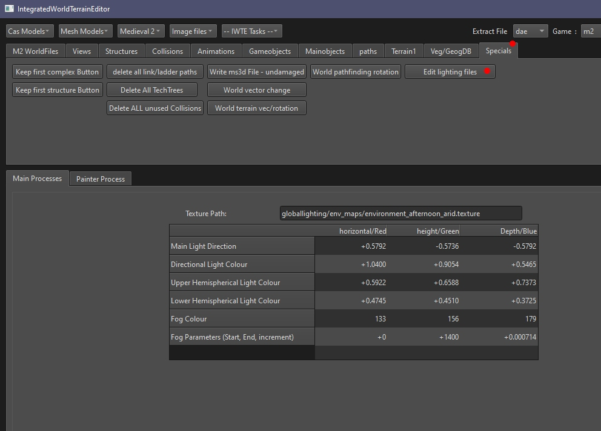

# Editing M2TW .lighting files

M2TW .lighting files are short binary files found in data/globalighting.  They are referenced by the weather_db.xml file.

The .lighting files control the fog and lighting colours and lighting direction on the battlemap.  They should be amended if you alter the sky textures.

Open a .lighting file in IWTE using the buttons:  
***Specials > Edit lighting files***

The Fog Colour is written in RGB values from 0 to 255.  The other variables are written as floats.  When finished press OK and a new file will be written in the original directory named with the addition of _wd, e.g. *original_name_wd.lighting*
