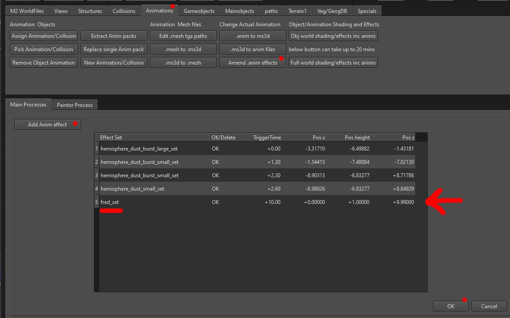

# Editing M2TW settlement building animations

# VERY VERY WIP TO BE DONE

* Export existing animation to dae (collada)
* Amend anim export from Blender
* End file name with _damageTransition0 or as required
* Import to animation

## Changing M2TW Building Animation Effects  

The visual effects triggered by animations can be changed using the screen/button ***Animations/Amend .anim effects***  

Load the .anim you want to change, select *Add Anim effect* to add lines, use the delete drop-down button if you want to remove a line, double click an entry to edit it.  The effect set can be any effect set in the files referenced from descr_effects.txt.  The coordinates given are relative to the center of the object's collision, e.g. 0,0,0 in Blender for the .anim.  Click OK when done.  The revised .anim will be saved with -1 added to the name to prevent accidental overwrites, change the name to use in game.
