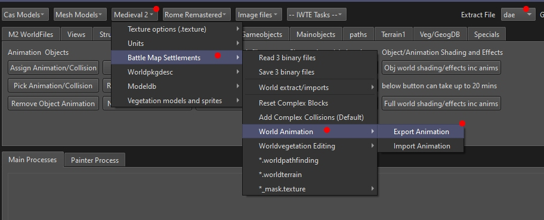
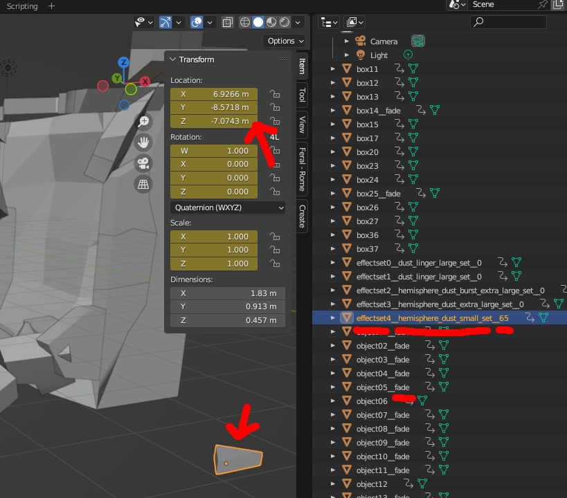

# Editing M2TW settlement building animations

***NOTE: Any custom anims or re-named vanilla anims will crash the game for Mac/Linux computer users.  We therefore no longer recommend using modified anims.  Gates are the only world objects that must have animations to function. Walls and towers can simply jump between damaged states.***

M2TW building animation components are referenced from the .world file, they are normally located in *data/blockset/cultureRef/animations/type_of_anim/anim_set*, the components are:
* .anim - this controls the movement of the objects
* .evt - for sounds
* .mesh - controls vert to 'bone' assignment and texture used

The vertex positions and lighting assigned to specific instances of an animation are included in the .animinstances file associated with each .world file.  Unfortunately even minor amendments to existing .anims will still trigger you needing to go through the whole 'create new animation' process, converting the anim to glb/dae and back will change the vertex order which will create a mismatch between the .anim and the contents of the world's .animinstances content for the objects using that .anim.

## Creating and Applying an Animation

* use ***Medieval 2 > Battle Map Settlements > World Animation > Export Animation*** to get a dae/glb to work from
* amend file in Blender and export result to dae/glb
* name the file to end in the appropriate transition name
* ***Medieval 2 > Battle Map Settlements > World Animation > Import Animation***
* repeat for all the damage transitions the object will use
* check you have .packed files for all the transitions in one folder
* load your settlement's 3 binary files in IWTE
* select object that will use animation and use screen/button ***Animations > New Animation/Collision*** navigate to folder with the .packed files
* follow any prompts if required to set up wall/gate breach attributes
* correct naming of animations using screen/button ***M2 WorldFiles > update animation paths***
* apply to any other objects that need the same animation set by selecting object and using screen/button ***Animations > Assign Animation/Collision*** selecting the object that has the correct anim/collision from the drop-down
* save 3 binaries

## Editing .anims in Blender

Check the Extract File type you want is set and use ***Medieval 2 > Battle Map Settlements > World Animation > Export Animation***, select the .anim you want.

Load the dae/glb extract from an existing anim into Blender, you will see that they comprise some static objects, some with animations and some that simply store information about the effects:

Ending an object name with *__fade* will make IWTE set the indicator for the object to fade out towards the end of the animation.  Please note that this feature doesn't work that well in game as parts of the anim that should become visible behind the fading part are not rendered!

Effects are stored with an object name starting *effectset*, then double underscore *effect_set_name*, double underscore *time in multiples of 1/10sec*, the position is taken from the location the object has been moved to (do not apply transforms).

Building anims do not use a skeleton or bone weighting.

When you export from Blender remember to include the required transition name at the end of the file name , e.g. _DamageTransition0.glb etc.  Use ***Medieval 2 > Battle Map Settlements > World Animation > Import Animation*** to convert back.

## Changing M2TW Building Animation Effects  

The visual effects triggered by animations can be changed using the screen/button ***Animations/Amend .anim effects***  

Load the .anim you want to change, select *Add Anim effect* to add lines, use the delete drop-down button if you want to remove a line, double click an entry to edit it.  The effect set can be any effect set in the files referenced from descr_effects.txt.  The coordinates given are relative to the center of the object's collision, e.g. 0,0,0 in Blender for the .anim.  Click OK when done.  The revised .anim will be saved with -1 added to the name to prevent accidental overwrites, change the name to use in game.
