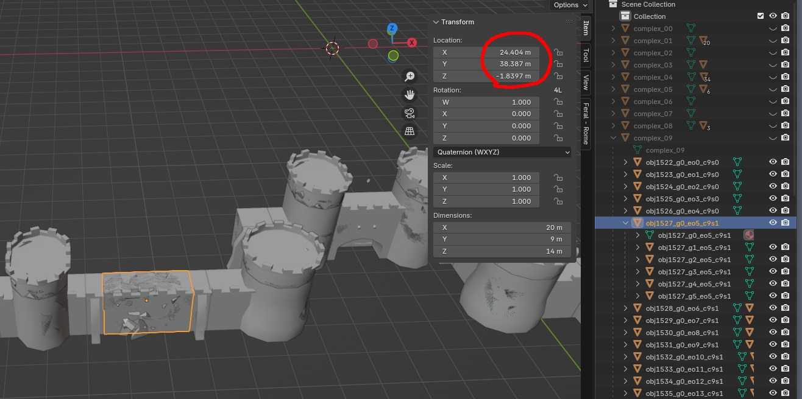
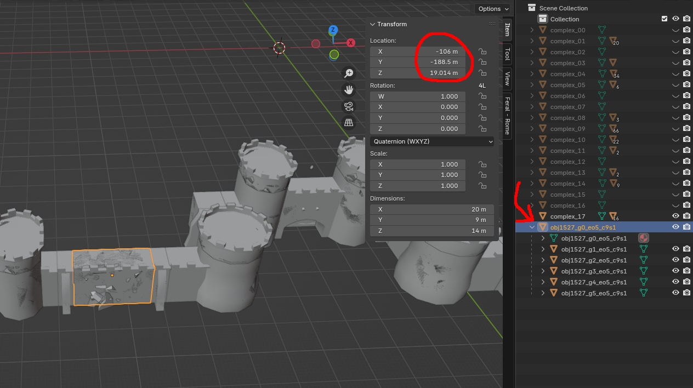
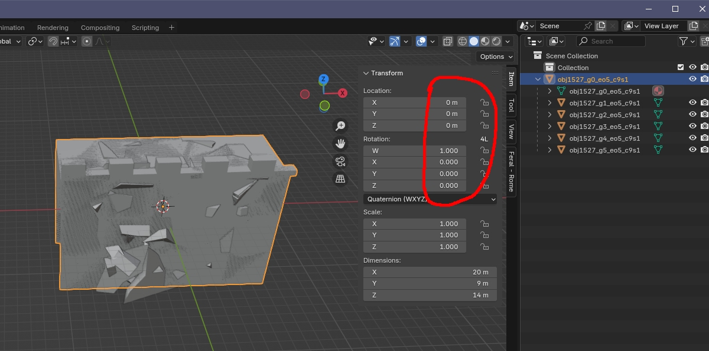

# Editing M2TW settlement building animations using IWTE and Blender
The older export/import to/from ms3d process is still available, however we strongly recommend using Blender instead.

## Finding your starting point

The collision of an object is created as if there was a collision mesh centered on 0,0,0 and then moved and rotated to the object's position.  An animation applied to an object will be shown in game as having been moved over the same  movement/rotation transformation matrix as the collision.  This means the animation needs to be set up with the same relationship to 0,0,0 as a generated collision for the object.

To find that for an object that has been added to a .world file, export the .world to .glb/.dae and load in Blender.  Select the group0 of the object you want, ideally this will be a basically rectangular object aligned parallel to all axis.

Bring up the side-bar and you will see Blender show's its location relative to the Complex it is a child of.
Use right-click > Parent > **Clear and Keep Transform**.  The object won't have moved but you will notice the location is now shown relative to the whole scene and the object is no-longer listed inside a complex:

Type 0 into the x,y,z location values and the object (and its sub-groups) will be moved to be centered on 0,0,0 in the same way that a collision based on it would be formed.

Any other components of the .world can be deleted and this .blend file used as the starting point for your animation.

## Editing existing .anims in Blender

Check the Extract File type you want is set and use ***Medieval 2 > Battle Map Settlements > World Animation > Export Animation***, select the .anim you want.

Load the dae/glb extract from an existing anim into Blender, you will see that they comprise some static objects, some with animations and some that simply store information about the effects:

Ending an object name with *__fade* will make IWTE set the indicator for the object to fade out towards the end of the animation.  Please note that this feature doesn't work that well in game as parts of the anim that should become visible behind the fading part are not rendered!

Effects are stored with an object name starting *effectset*, then double underscore *effect_set_name*, double underscore *time in multiples of 1/10sec*, the position is taken from the location the object has been moved to (do not apply transforms).

Building anims do not use a skeleton or bone weighting.

When you export from Blender remember to include the required transition name at the end of the file name , e.g. _DamageTransition0.glb etc.  Use ***Medieval 2 > Battle Map Settlements > World Animation > Import Animation*** to convert back.

Please see [required glb export options for animations](Blender_4plus_and_glb.md#for-animations).
