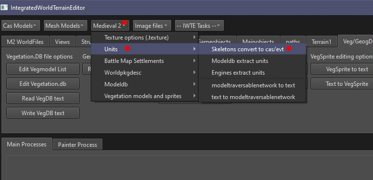

# Re-creating full cas and evt files from M2 .idx/.dat packs

This function 'unpacks' M2TW skeleton and animation packs to re-create the editable .cas animation files and .evt files which are suitable for re-packing by the game engine.  See https://github.com/makanyane/IWTE/wiki/Cas-Files#user-content-Full_Cas_Files for an explanation of .cas types.

Access the function by using buttons **Medieval 2 > Units > Skeletons convert to cas/evt**

