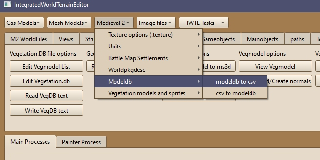
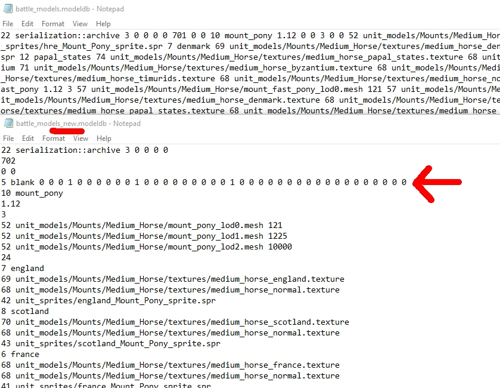
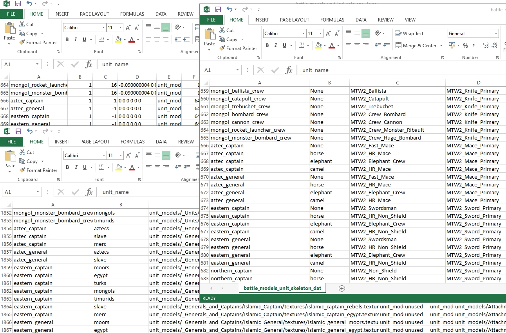
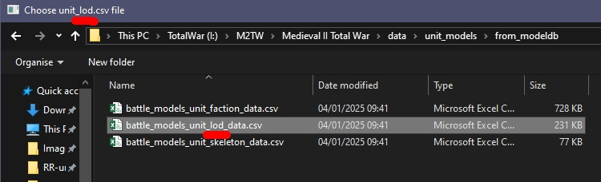

# M2TW battle_models.modeldb

The battle_models.modeldb is found in data/unit_models.  It controls which meshes, textures and skeletons are used for battlemap unit and mounts. Errors in the modeldb including incorrect counts of characters in paths/names can cause the game to CTD.

IWTE provides a modeldb to csv and back function that checks for errors in the file, allows editing in spreadsheet form and re-formats the modeldb.  To launch the process use:
***Medieval 2 > Modeldb > modeldb to csv***

This will create a sub-folder called *from_modeldb* where-ever your modeldb was, this will include:
* battle_models.txt - if the process has crashed look at the end of this file it will show approximately how far IWTE was able to read
* battle_models_errors.txt - this will list any errors that did not crash the process, e.g. mismatched factions in the texture versus attachment list, or including trailing spaces in path character counts
* battle_models_new.modeldb - this is a reformatted version of the input modeldb
* battle_models_unit_lod_data.csv - contains scale, torch info, lod and mesh info for each unit
* battle_models_unit_faction_data.csv - contains texture, sprite and attachment info for each unit, per included faction
* battle_models_unit_skeleton_data.csv - contains primary, secondary and weapon skeleton information for each unit, per mount type (captains/generals have multiple mount type entries)

The reformatted file includes line breaks and spaces to make the information easier to read. A 'blank' entry is added at the start of the file so that 'first time pads' do not have to be added to the first useable entry.

An example of the three csv files opened in separate Excel windows is shown above.  Using excel or similar you can filter or sort the information.  You can also add/remove units, but please make sure the same unit names are used in all three files.  Note that the csv to modeldb process will print the file with units in the **order of the _lod_data.csv**, if you wish to retain your mods modeldb sequence do not change the order of this file.

When using the ***Medieval 2 > Modeldb > csv to modeldb*** buttons to generate a new modeldb you will be asked for the three files in turn, please note and match the name of file it is asking for.

Amended modeldb files will be created with the name *battle_models_fromcsv.modeldb*
