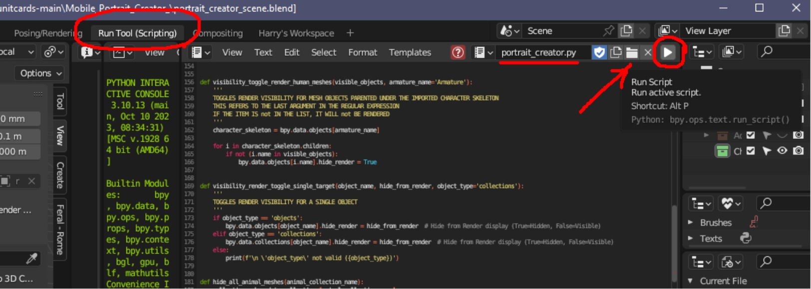
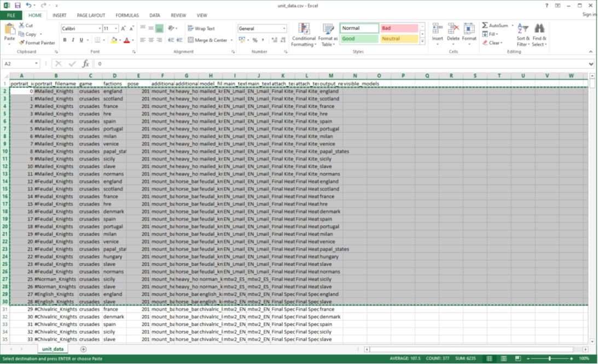
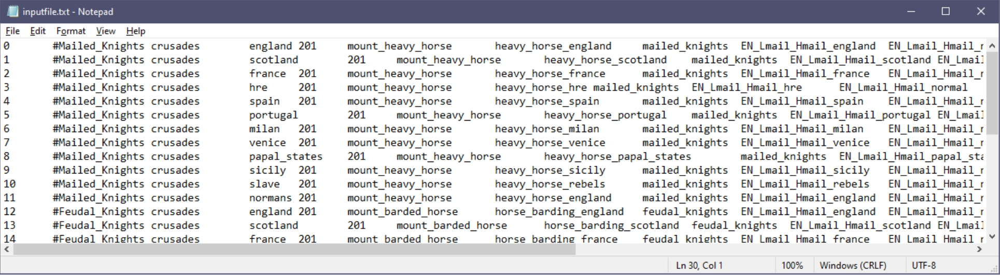
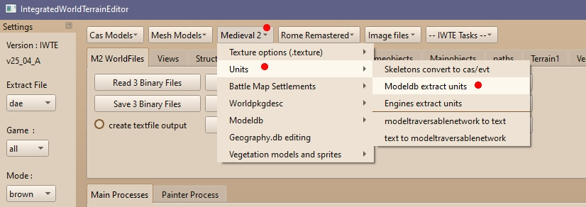
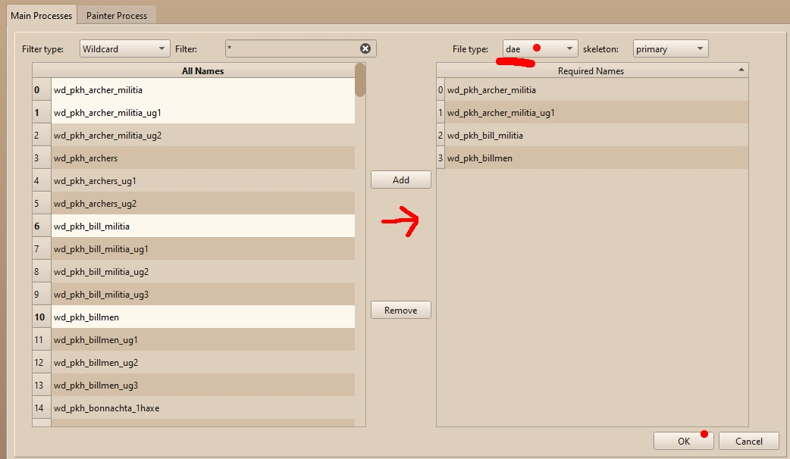
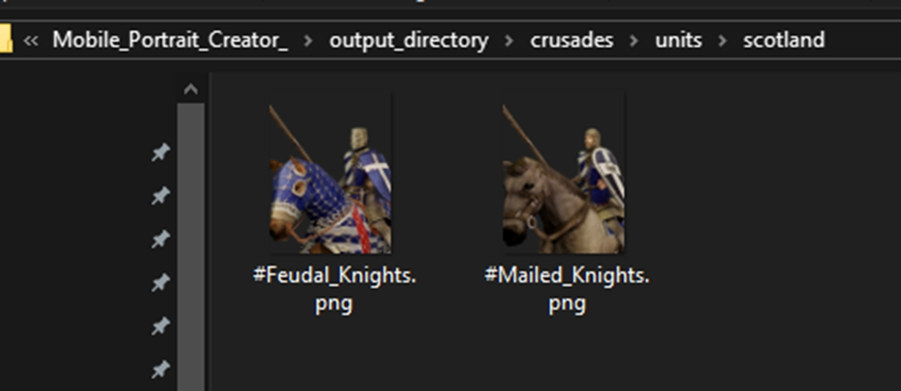
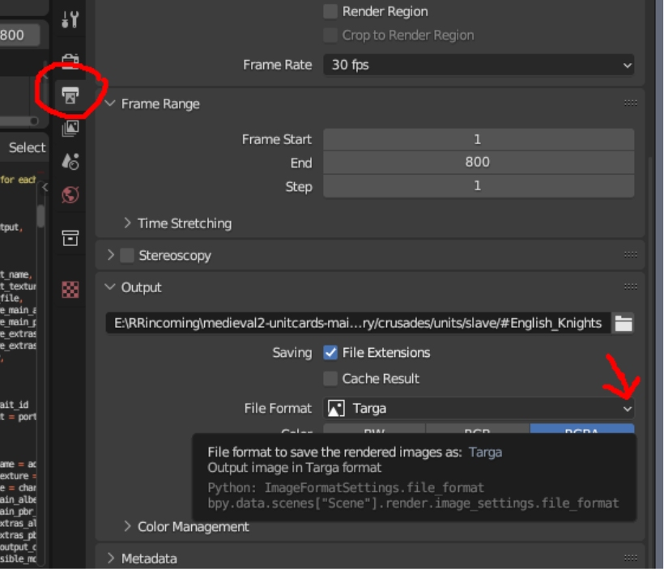
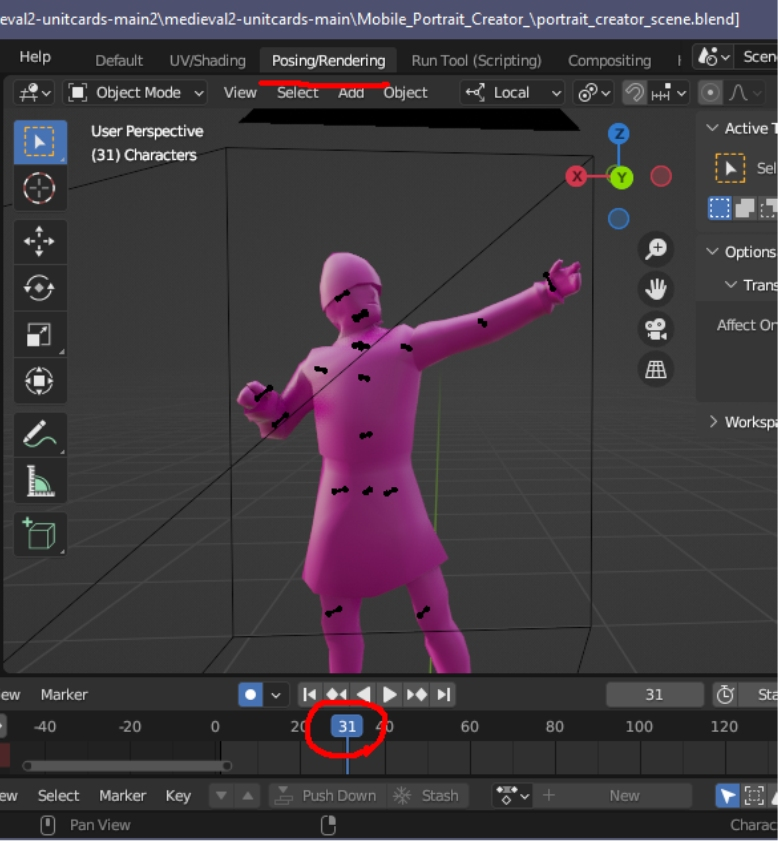

# FERAL UNIT CARD RENDERING PROCESS FOR M2TW

Feral’s instructions are here: https://github.com/FeralInteractive/medieval2-unitcards

For the Feral tool go to https://github.com/FeralInteractive/medieval2-unitcards/tree/main
click the ‘Code’ dropdown menu and ‘Download ZIP’

For Blender go to https://www.blender.org/download/lts/3-6/
for **Blender version 3.6 LTS**  (.dae support has been removed from the 4* series)

For IWTE see the main page of this Github.

Install/unzip the above if you don’t already have them.

## CHECKING BLENDER SET-UP

Delete/rename the example file in *Mobile_Portrait_Creator_\output_directory\base\units\milan*

Open Feral’s *portrait_creator_scene.blend*

 
In the ‘Run Tool (Scripting)’ window use ‘open’ button and navigate to load Feral’s *portrait_creator.py*, click the ‘Run Script’ button.

You now should have a new version of the *#peasant_crossbowmen.png*

Do the same with *portrait_creator_scene_unit_info.blend* and the *portrait_creator - unit_info.py* script to check the Unit_info cards setup.

You can now get on with producing the assets needed for your mod.

Take some time to familiarise yourself with the folder setup, note that the default /source_assets folder and /output_directory folder are in the Mobile_Portrait_Creator folder together with the .blend files and inputfile.txt
 
## INPUT FILE
You will need to adapt the 
Mobile_Portrait_Creator_\inputfile.txt 
to include the units and factions that you want to produce cards for.

Make a task file for IWTE containing the following text:

    <task_id> 			unit_card_data                            
    <mod_directory_in> 		"C:\your_folder_structure\Medieval II Total War\mods\your_mod" 
    <directory_out>		"C:\your_folder_structure\your_output_folder"  

Save that as a .txt file with name ending   *_task.txt  or download this [task file example](../task_file_examples/M2_UNIT_CARD_data_for_Feral_Blender_addon_task.txt) and adapt it.

Use IWTE, select and run that task file.  This will generate a unit_data.csv file in the output folder you specified.  Open the .csv file in a spreadsheet program such as Excel.  You can now filter/select the units you want to add to the input file. Copy and paste the relevant lines into your inputfile.txt and save.

Note:  Importing the csv file into a spreadsheet is a required step so that the data you paste into the input file has spaces instead of commas between sections.

 

 
## DAE AND TEXTURES

Use IWTE > Medieval 2 > Units > Modeldb extract units to convert the mesh files and textures.

 
Click that button and navigate to your mod-folder, select the mod-folder itself, e.g. ‘crusades’
Then select an output folder for  the .dae and .dds files.

When the screen populates you can select the units you want from the left side, and ‘Add’ to the right side, then click OK to start the process.  There are wildcard (*) and fixed string filters available to help you find specific names.

**Dae** is the required option for the Feral cards.  Primary or secondary skeleton may be selected but this will not affect which weapon is shown in the Feral render!

If you are rendering a mounted unit you will need to separately select and process the relevant mounts.
 
 
## POSITIONING THE ASSETS

See the Feral instructions for full details of the expected folder structure.  For this case where I’m dealing with input from the ‘Crusades’ mod-folder, I need to place files as follows;

*Soldier .dae model files >	Mobile_Portrait_Creator/source_assets/models/human/**crusades** 
*Soldier .dds texture files > 	Mobile_Portrait_Creator/source_assets/textures/human/**crusades**
*Mount .dae model files >	Mobile_Portrait_Creator/source_assets/models/**animal**
*Mount .dds texture files >	Mobile_Portrait_Creator/source_assets/textures/**additional_objects**

‘crusades’ should be switched to your mod-name as per the input file

The folders marked in bold will need to be created.

If your soldier and mount files have been extracted to the same folder and are hard to disentangle just paste copies of all models/textures into both folders, you can delete them all later!

You can now open the Blend files and run the scripts as described above.  The render process will go through each line item in turn.

Your new cards will be placed in faction specific folders within output_directory/your_mod_name/units/faction_name

 
## OUTPUT TYPE

To get tga files instead of .png you can switch the file format output setting within Blender using this drop-down.

## POSE SELECTION

The csv file IWTE generates uses pose no 20 for all infantry unit and pose 201 for all mounted units, if you need a different pose go to the Posing/Rendering window and move the blue slider along to view the poses.  Change the pose number in your input file to the frame number of the pose you want.

