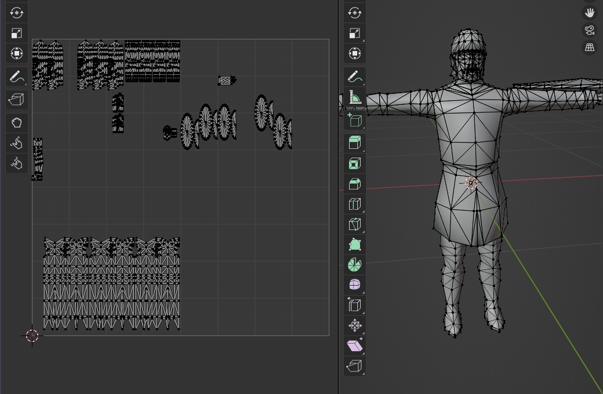
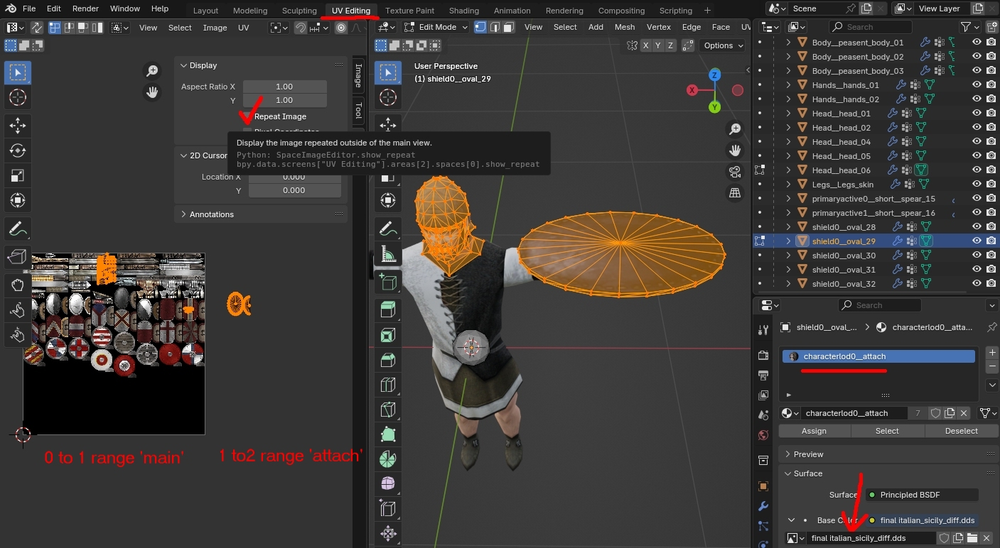
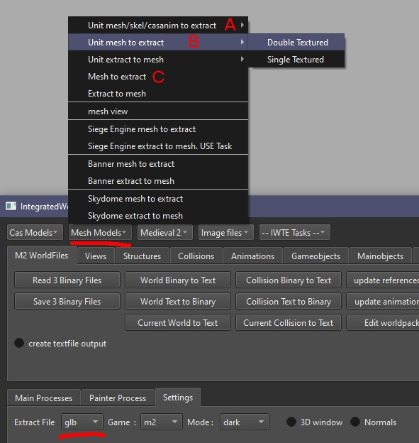

# M2TW unit meshes
Battle-map unit models in M2TW are in .mesh format which differs substantially from the .cas format used for strat-map characters and battle-map units in RTW/RR.  A major difference is that the .mesh does not contain bone positions, e.g. no 'skeleton'.

## Double/single textures

Contrary to popular belief there is no difference in the .mesh file for units that use a main and attachment texture and those that only have a main texture.  The textures used are specified solely in the battle_models.modeldb file.  If you want a unit to use an attachment texture the uv's have to be 'squished' together.  Opening a vanilla M2 unit which uses an attachment texture via IWTE  
**Mesh Models > Unit Mesh to Extract > Single Textured**  
gives this result when viewed in Blender.  This is an accurate representation of how the uv's are written in the .mesh file, in game they will be stretched over the two textures if a second texture is listed in the modeldb.

Opening the same model using IWTE  
**Mesh Models > Unit Mesh to Extract > Double Textured**  
gives the result shown below:

Assigning the attachment texture to characterlod0__attach and the main texture to characterlod0__main will give you a correct view of the model **IN BLENDER**.  The assignment of the textures cannot be saved to the .mesh file.  To get the textures used correctly in game you need to have all the uvs to be displayed on the main texture in the 0 to 1 range and all the uvs to be displayed on the attachment texture in the 1 to 2 range, export the file and use IWTE  
**Mesh Models > Unit Extract to Mesh > Double Textured**  
to make the amended mesh.  To accurately view how the uvs in the 1 to 2 zone align you can toggle the 'Repeat Image' button in Blender.

## Unit mesh to extract

IWTE provides three buttons for the mesh_to_extract task process, they all launch the same task but will ask you for slightly different information.  To use choose the type of extract file you want first, glb/dae/ms3d, from the drop down box on settings.  This choice will be saved to your settings file. 

If you don't need an animation applied to the unit you can use any button A, B or C and simply press cancel when asked for the 2nd and 3rd file.  For double textured units select that option after menu option A or B.

To apply animations to a double textured unit you need either:  
A - **Unit mesh/skel/casanim to extract > Double Textured** and a skeleton file and animation as obtained by unpacking with Toolbox of XIDX, or
B - **Unit mesh to extract > Double Textured** and Caliban/Devkit style full cas animations for the default (basepose) and your desired animation.
