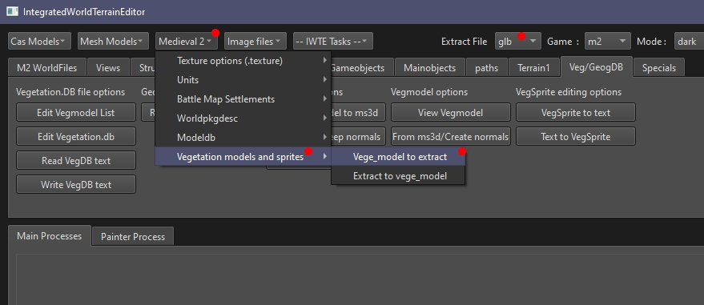

# M2TW vege_models

The vege_models are found in data/vegetation/models, each model calls one .texture which is located in data/vegetation/models/textures.

Some vanilla models (a large rock and cactus model) have a bug where either they can have see-through sections.  This is caused by their uv mapping exceeding the 0 to 1.0 range.  Textures for vege_models do not wrap around, they map onto the 'next' texture.  M2 compiles all the used vegetation textures into one large texture map in game memory, models mapped outside the 0 to 1 uv range, OR textures that are larger/smaller than the others causes vege_models to be displayed with the wrong textures.

## Creating Vege_Models

See TWC tutorial for creation of vege_models using Milkshape https://www.twcenter.net/forums/showthread.php?577141-IWTE-Vegetation-editing  

To convert a vege_model to dae/glb/ms3d, check the extract file type you want is selected in the drop-down box then use ***Medieveal 2 > Vegetation models and sprites > Vege_model_to_extract***.  

NOTE:  Do not allow uv maps for the vege_models to exceed the 0 to 1 range.  Do not use textures for the vege_models that are larger than other vegetation textures.  The game compiles all the vegetation textures into one texture map in game, change of size or uv's exceeding range will result in models using parts of other models textures!
