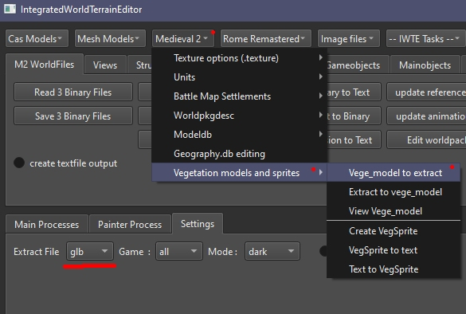

# M2TW vege_models

The vege_models are found in data/vegetation/models, each model calls one .texture which is located in data/vegetation/models/textures.  In game vege_models are viewed in game until a distance set by the [vegetation.db](M2_worldvegetation.md) file in combination with the user's settings, after that [vege_sprites](M2_vege_sprites.md) are rendered. Vegetation distribution is set in the [geography.db](geography_db.md#m2-specific-elements).

Some vanilla models (a large rock and cactus model) have a bug where either they can have see-through sections.  This is caused by their uv mapping exceeding the 0 to 1.0 range.  Textures for vege_models do not wrap around, they map onto the 'next' texture.  M2 compiles all the used vegetation textures into one large texture map in game memory, models mapped outside the 0 to 1 uv range, OR textures that are larger/smaller than the others causes vege_models to be displayed with the wrong textures.

M2TW vege_models are illuminated in game in a different way from the RTW .cas/veg models.  If you have flat leaf or branch sections which are single sided they will be viewable from both sides, viewing them from the reverse side will show them with the opposite lighting from what you'd expect, e.g. if the side you're viewing from should be in sunlight you'll see that reverse side section in shadow instead.  Making double sided sections doesn't solve this, to get around the problem you need double sided sections with 'co-planar' normals.

## Creating Vege_Models

See TWC tutorial for creation of vege_models using Milkshape https://www.twcenter.net/forums/showthread.php?577141-IWTE-Vegetation-editing  

To convert a vege_model to dae/glb/ms3d, check the extract file type you want is selected in the drop-down box then use ***Medieveal 2 > Vegetation models and sprites > Vege_model_to_extract***.  

NOTE:  Do not allow uv maps for the vege_models to exceed the 0 to 1 range.  Do not use textures for the vege_models that are larger than other vegetation textures.  The game compiles all the vegetation textures into one texture map in game, change of size or uv's exceeding range will result in models using parts of other models textures!

## Double sided planes with co-planar normals

The work around for achieving this in milkshape is explained in the TWC tutorial https://www.twcenter.net/forums/showthread.php?577141-IWTE-Vegetation-editing.  Unfortunately it isn't possible to get Blender to retain co-planar normals without adding extra non-shared vertexes to each triangle.  IWTE has a special  method of converting vege_models to retain double_sided sections.

An extract from a vanilla vege_model in Blender will look like the below picture, you'll see that many parts are double sided and have separate normals for each side at 90 degrees to the triangle plane.

Converted back to vege_model and viewed in IWTEs 3d view with normals switched on, you'll see those sections have been converted back to double sided with co-planar normals (they follow the plane of the triangle).

Trunk sections or other 'solid' objects where the reverse side cannot be seen should be made as normal single sided planes.  

