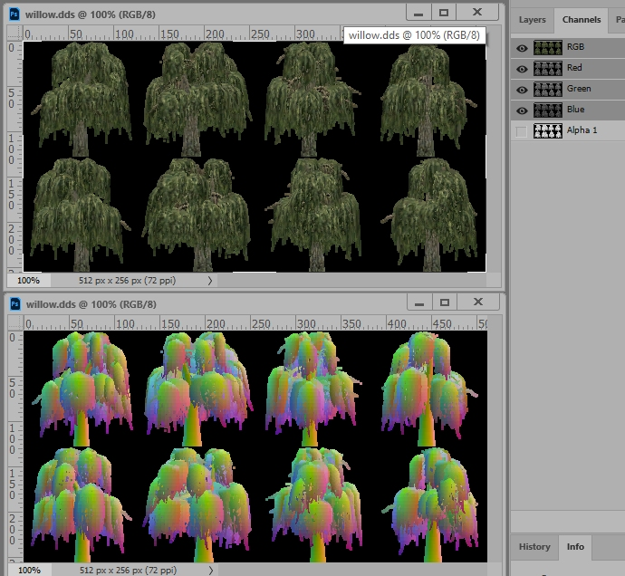
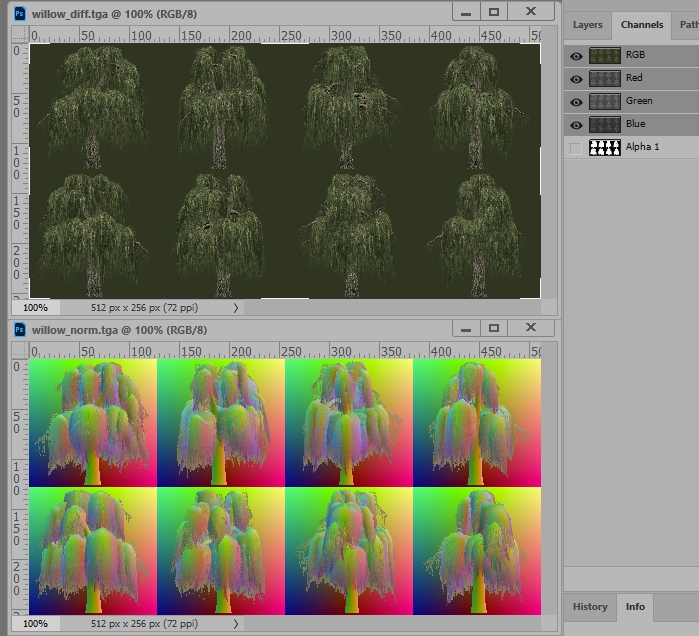

M2TW uses vege_sprites to replace rendering of [vege_models](M2_vege_models.md) at a distance set by the [vegetation.db](M2_vegetation_db.md) file in combination with the users graphics settings.  The Vege_Sprites themselves are small binary files that list a diffuse and a normal texture and give coordinates to be used within those textures for 8 possible viewpoints.

## Creating Vege_Sprites

The picture below shows the vanilla textures for the willow sprite.  Note that the 'normal' texture is nothing like the sort of normal map produced by the nvidia plug-in, the information on it is taken from the models geometry and not a translation of the diffuse texture.  

The image below shows sprite textures created by IWTE from the same model. Both textures are created from dds files with mip-maps.  Due to the tendency to blur in mip-maps you tend to get better results if the image background colour is close to the objects colour, therefore IWTE tries to use adjacent colours for the background.

To produce a vege_sprite using IWTE use the screen/button ***Veg/GeogDB > Create VegSprite***.  Select the .vege_model you want a sprite for, the .texture it uses should be available in a *textures* sub-folder below the model.

For model_name.vege_model IWTE will produce:
* IWTEsave/model_name.vege_sprite
* IWTEsave/model_name_**diff**.tga
* IWTEsave/model_name_**norm**.tga
* IWTEsave/textures/model_name_**diff**.textures
* IWTEsave/textures/model_name_**norm**.textures
  
If you want to alter the sprite images use the .tga files and process them to .dds/texture.  If you're happy with them just use the .texture files and transfer them and the .vege_sprite to the folders:
* data/vegetation/sprites
* data/vegetation/sprites/diffuse_maps
* data/vegetation/sprites/normal_maps
 
IWTE adds _diff and _norm to the diffuse and normal textures for ease of identification. The vege_sprite produced will be set up for this naming, the names do not need to be changed.  The .vege_sprite contains uv type dimension information telling the game which portions of the textures to display, this is set by IWTE at the same time as the texture generation, mismatching sprites and textures from different models can result in very odd results!

There are also Vege_Sprite editing options *VegSprite to text* and *Text to VegSprite* - you are unlikely to need to use or understand these unless something has gone wrong with the sprite creation process and you need to make adjustments.
