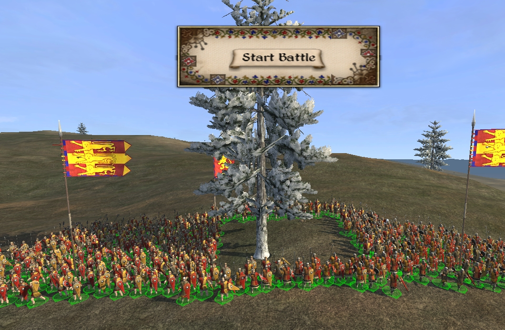
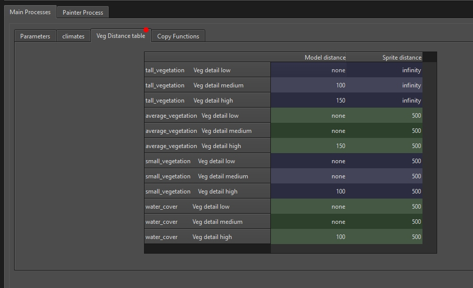

# M2TW vegetation.db 

In M2TW the vegetation.db file will be found in *data/vegetation* folder.  In RTW descr_vegetation.txt and descr_vegetation.db are found in the *data* folder, RTW will regenerate the db file from the text file.

The vegetation.db in M2TW is not regenerated by the game, IWTE functions have been developed to allow editing of the db.  RTW's inbuilt method of generating the vegetation db file from the text file also produces its required models and sprites so IWTE is not required for RTW vegetation.db changes.

#### Table of Contents

* [Adding items to the vegetation.db](adding-items-to-the-vegetationdb)
* [Editing the vegetation.db in IWTE](#editing-the-vegetationdb-in-iwte)
* [Editing the vegetation.db via text](#editing-the-vegetationdb-via-text)

#### See also
* [Creating Vege_Models](M2_vege_sprites.md#creating-vege_sprites)
* [Creating Vege_Sprites](M2_vege_models.md#creating-vege_models)

## Adding items to the vegetation.db

Use the IWTE screen/button ***Veg/GeogDB > Edit Vegmodel List*** and open your vegetation.db then select either:
* Add New Vegetation model
* Delete Vegetation model or
* Change veg model name

When adding items the model must end .vege_model and the sprite must end .vege_sprite, please ensure the names given correctly match the models/sprites in your mod. Missing items will crash the game.

Selecting 'OK - write files' will generate a new file with name ending -1.db to avoid accidental overwrites, re-name it to be used in game.

## Editing the vegetation.db in IWTE

Once your list contains all the items you want you can adjust where they are used in game. 
Use the IWTE screen/button ***Veg/GeogDB > Edit Vegetation.db*** and load the .db file you have updated.

You can adjust the models and settings used for each climate's summer and winter.  The models are selected by drop-down which includes the entire contents of your vegmodel list.  You can have up to 4 models per vegetation type.  Note that not all vegetation types appear to be used in game.  Cactii are useable and can be set to add less common tree models. Mangroves  and water_cover are only displayed around water.  The radius setting can help stop troops walking through large objects such as rocks, however it appears to be limited in scope, setting values from 10 to 99m resulted in the same sized blocked area as shown in the picture below.

The Veg Distance Table gives the viewing distance for models and sprites at Low/Medium/High quality settings.  'None' in any of the boxes means that the item will not be displayed at all at that quality setting. Infinity means the item will not switch off in distant views.

## Editing the vegetation.db via text

There are some complex sections of the vegetation.db which cannot be edited via the IWTE screen. To change these other aspects use the screen/button ***Veg/GeogDB > Write VegDB text*** to generate a text file, edit it as required and use ***Veg/GeogDB > Read VegDB text*** to update a vegetation.db file with your changes.

The aspect you're most likely to need to change via the text method is the grass, please see the tutorial:  
https://www.twcenter.net/forums/showthread.php?657346-Re-Grass-editing-in-vegetation-db

