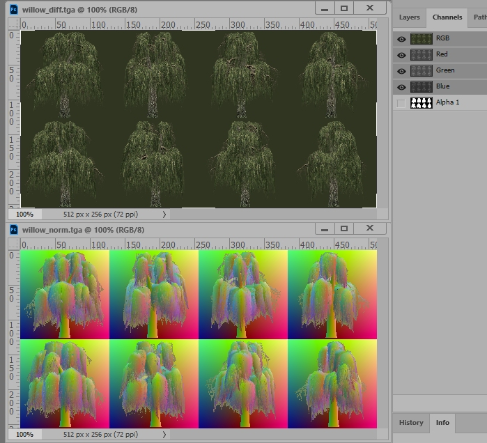

# M2TW vegetation.db 

In M2TW the vegetation.db file will be found in *data/vegetation* folder.  In RTW descr_vegetation.txt and descr_vegetation.db are found in the *data* folder, RTW will regenerate the db file from the text file.

The vegetation.db in M2TW is not regenerated by the game, IWTE functions have been developed to allow editing of the db.  RTW's inbuilt method of generating the vegetation db file from the text file also produces its required models and sprites so IWTE is not required for RTW vegetation.db changes.

#### Table of Contents

* [Adding items to the vegetation.db](adding-items-to-the-vegetationdb)
* [Editing the vegetation.db in IWTE](#editing-the-vegetationdb-in-iwte)
* [Editing the vegetation.db via text](#editing-the-vegetationdb-via-text)
* [Creating Vege_Models](#creating-vege_models)
* [Creating Vege_Sprites](#creating-vege_sprites)

## Adding items to the vegetation.db

Use the IWTE screen/button ***Veg/GeogDB > Edit Vegmodel List*** and open your vegetation.db then select either:
* Add New Vegetation model
* Delete Vegetation model or
* Change veg model name

When adding items the model must end .vege_model and the sprite must end .vege_sprite, please ensure the names given correctly match the models/sprites in your mod. Missing items will crash the game.

Selecting 'OK - write files' will generate a new file with name ending -1.db to avoid accidental overwrites, re-name it to be used in game.

## Editing the vegetation.db in IWTE

Once your list contains all the items you want you can adjust where they are used in game. 
Use the IWTE screen/button ***Veg/GeogDB > Edit Vegetation.db*** and load the .db file you have updated.

You can adjust the models and settings used for each climate's summer and winter.  The models are selected by drop-down which includes the entire contents of your vegmodel list.  You can have up to 4 models per vegetation type.  Note that not all vegetation types appear to be used in game, and some such as water_cover are only used in specific zones.

The Veg Distance Table gives the viewing distance for models and sprites at Low/Medium/High quality settings.

## Editing the vegetation.db via text

There are some complex sections of the vegetation.db which cannot be edited via the IWTE screen. To change these other aspects use the screen/button ***Veg/GeogDB > Write VegDB text*** to generate a text file, edit it as required and use ***Veg/GeogDB > Read VegDB text*** to update a vegetation.db file with your changes.

The aspect you're most likely to need to change via the text method is the grass, please see the tutorial:  
https://www.twcenter.net/forums/showthread.php?657346-Re-Grass-editing-in-vegetation-db

## Creating Vege_Models

## Creating Vege_Sprites

The Vege_Sprites are small binary files that list a diffuse and a normal texture and give coordinates to be used within those textures for 8 possible viewpoints.  The picture below shows the vanilla textures for the willow sprite.  Note that the 'normal' texture is nothing like the sort of normal map produced by the nvidia plug-in, the information on it is taken from the models geometry and not a translation of the diffuse texture.  

The image below shows sprite textures created by IWTE from the same model. Both textures are created from dds files with mip-maps.  Due to the tendency to blur in mip-maps you tend to get better results if the image background colour is close to the objects colour, therefore IWTE tries to use adjacent colours for the background.

To produce a vege_sprite using IWTE use the screen/button ***Veg/GeogDB > Create VegSprite***.  Select the .vege_model you want a sprite for, the .texture it uses should be available in a *textures* sub-folder below the model.

For model_name.vege_model IWTE will produce:
* IWTEsave/model_name.vege_sprite
* IWTEsave/model_name_**diff**.tga
* IWTEsave/model_name_**norm**.tga
* IWTEsave/textures/model_name_**diff**.textures
* IWTEsave/textures/model_name_**norm**.textures
  
If you want to alter the sprite images use the .tga files and process them to .dds/texture.  If you're happy with them just use the .texture files and transfer them and the .vege_sprite to the folders:
* data/vegetation/sprites
* data/vegetation/sprites/diffuse_maps
* data/vegetation/sprites/normal_maps
 
IWTE adds _diff and _norm to the diffuse and normal textures for ease of identification. The vege_sprite produced will be set up for this naming, the names do not need to be changed.

There are also Vege_Sprite editing options *VegSprite to text* and *Text to VegSprite* - you are unlikely to need to use or understand these unless something has gone wrong with the sprite creation process and you need to make adjustments.
