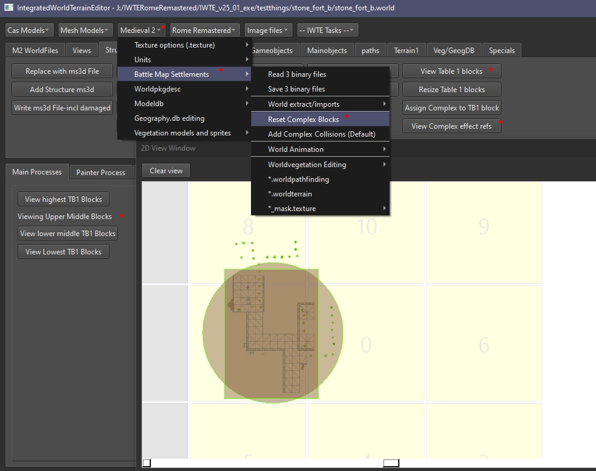

# M2TW world complex blocks

Vanilla settlements in M2TW have their complexes assigned to a notional complex block which is a cube within a 4x4x4 grid.
These blocks help with bounding box/sphere useage in game including the way lighting effects are handled.

Many modded settlements end up with either everything in complex 0 or a 'mess' of locations for the complexes.  Using IWTE's reset complex blocks function will assign objects to the most appropriate complex, adding complexes if necessary.

## Resetting complex blocks

The image below shows a vanilla complex, and its complex effects (the effects that can influence structures in the complex)

Use **Medieval 2 > Battle Map Settlements > Rest Complex Blocks** to get IWTE to re-organise your modded settlement into the appropriate complexes, then Save the 3 binaries and rename to use in game.  The process will retain collisions and main object information etc.  If you have light emitting effects you should run the world shading/effects process after reseting complex blocks.
