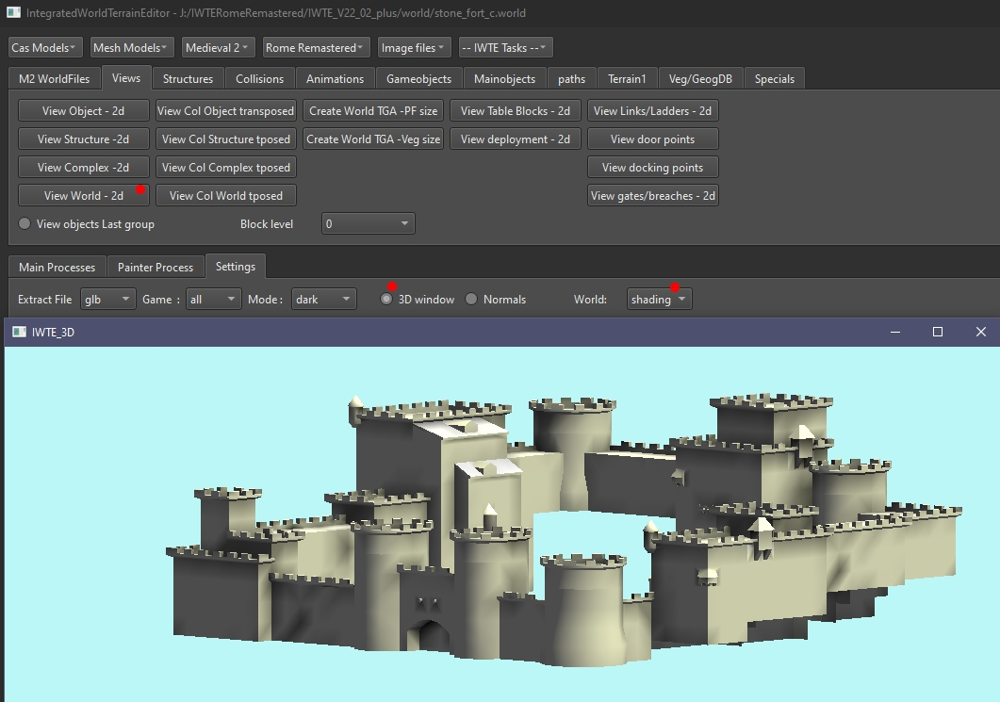
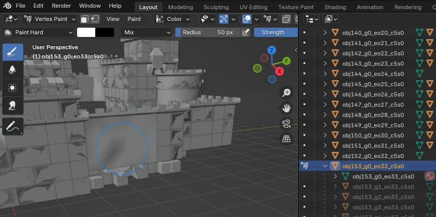
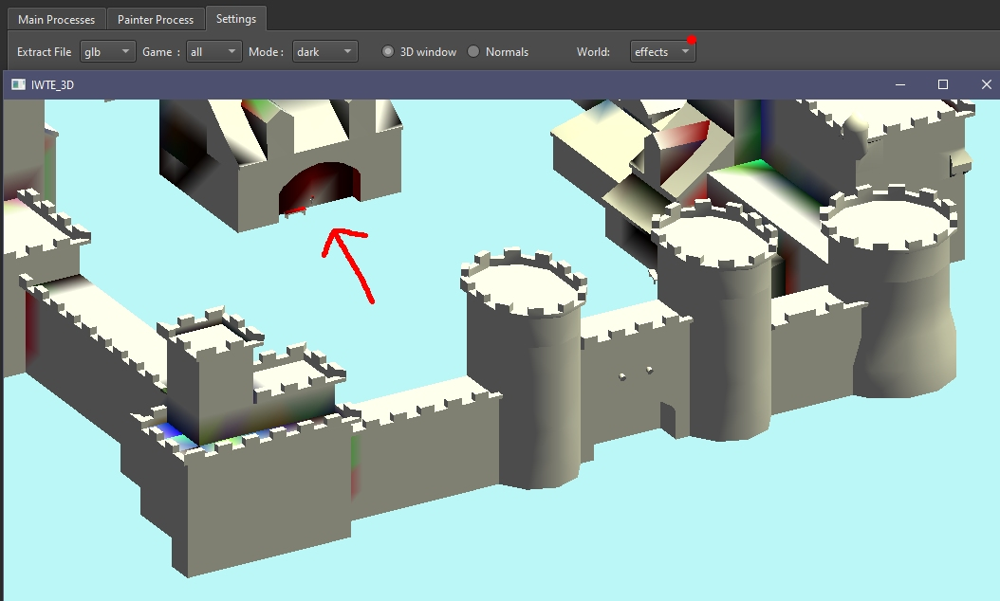

# M2TW world shading and lighting effects

Buildings (or any mesh objects in a .world) have values for shading and influence from lighting effects assigned per vertex.  The shading value applies an adjustment from black to white as a modifier to the texture around each vertex.

## Shading effects
The shading effect can be viewed in IWTE's 3d window.  The picture below shows vanilla stone_fort_c, you can see there is some shading around corners and under overhangs, and some random splotches on walls.

IWTE retains the shading information when world components are edited via:
* Milkshape - bones called light and dark with the relevant percentage bone weighting to each
* Blender - shading values are accessible via 'vertex paint' mode

Exporting and re-importing parts of world meshes will therefore retain their original shading values unless you manually alter them.  The below picture shows group0 of a wall section in vertex paint mode in Blender. Unfortunately Blender will only allow you to view or paint on one mesh group at a time!  You are very unlikely to want to try to re-shade things manually!

## Lighting effects

When effects are added to collisions they can be classed as 'light emitting'.  Light emitting effects can have a value applied to surrounding vertexes which applies a percentage of the effect to that vertex when the effect is 'on'.  Vertexes that have a light effect can be viewed in IWTE 3d view.  In the view of stone_fort_c below the arched niche the arrow is indicating has an object using a torch effect in it, which causes the lighting effect.

