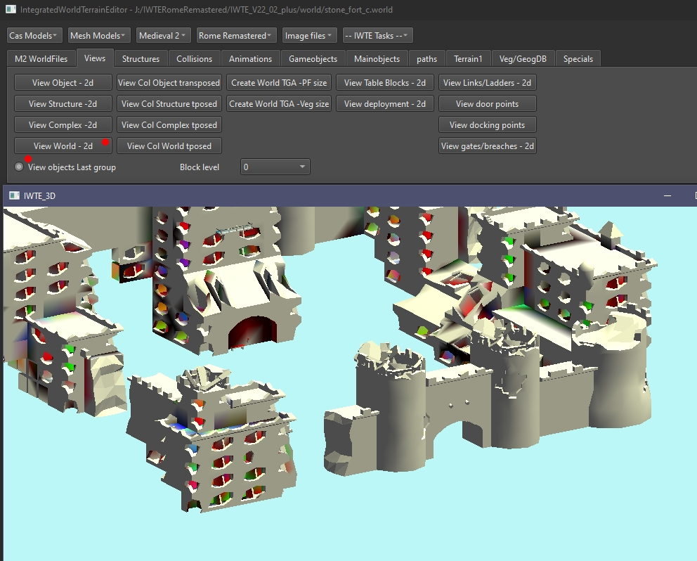
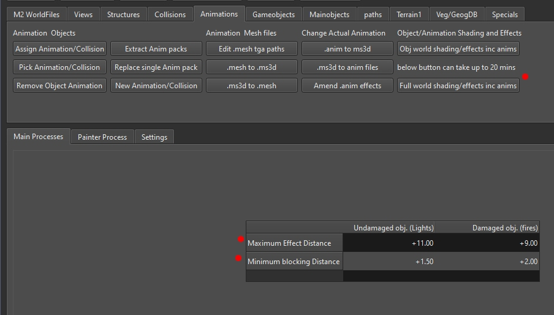

# M2TW world shading and lighting effects

Buildings (or any mesh objects in a .world) have values for shading and influence from lighting effects assigned per vertex.  The shading value applies an adjustment from black to white as a modifier to the texture around each vertex.  Applying the full black shading makes buildings appear black in game, which is apparently how CA managed to create partly black settlements in a Steam update of M2!

## Shading effects
The shading effect can be viewed in IWTE's 3d window.  The picture below shows vanilla stone_fort_c, you can see there is some shading around corners and under overhangs, and some random splotches on walls.

IWTE retains the shading information when world components are edited via:
* Milkshape - bones called light and dark with the relevant percentage bone weighting to each
* Blender - shading values are accessible via 'vertex paint' mode

Exporting and re-importing parts of world meshes will therefore retain their original shading values unless you manually alter them.  The below picture shows group0 of a wall section in vertex paint mode in Blender. Unfortunately Blender will only allow you to view or paint on one mesh group at a time!  You are very unlikely to want to try to re-shade things manually!

## Lighting effects

When effects are added to collisions they can be classed as 'light emitting'.  Light emitting effects can have a value applied to surrounding vertexes which applies a percentage of the effect to that vertex when the effect is 'on'.  Vertexes that have a light effect can be viewed in IWTE 3d view.  In the view of stone_fort_c below the arched niche the arrow is indicating has an object using a torch effect in it, which causes the lighting effect.  Most of the other areas that show effects are from overspill from damaged state fire effects.

Viewing with the *View objects last group* option selected shows where the damage effects are having most effect.

Each vertex can be illuminated by up to 3 effects. Each complex can have up to 69 effects illuminating vertexes in its objects.  The multiple colours in the IWTE view occur as a different colour is used for 1st, 2nd and 3rd effects.  Each vertex holds the information:  
*  Effect Number (in .world), Percentage Applied - for 1st effect if there is one
*  Effect Number (in .world), Percentage Applied - for 2nd effect if there is one
*  Effect Number (in .world), Percentage Applied - for 3rd effect if there is one

The % applied has to be calculated and is used to simulate the fall off of illumination from the effect, the colour that is applied to the illumination effect in game is taken from the information in the effect_set in files such as descr_burning_building.txt.  If your .world or .animinstances have vertexes that include a reference to an effect number greater than the number of effects in that particular .world then you will get the 'disco lighting' bug, where the game doesn't know what colour it should be applying or when the effect is 'on'.

The lighting effect information is not stored in world components exported to Milkshape or Blender. After amending world components in Milkshape/Blender and/or just exporting and re-importing them, you will need to reset lighting and shading to get the effect of effects back!

## Resetting lighting and shading

To reset the shading and lighting effects recorded on vertexes in the .world use screen/button  
**Animations > Full world shading/effects inc anims**. Click OK if you wish to accept the default values, select unpacked data/blockset folder, then select your_mod/data/blockset folder if you have amended animations.

If you increase the maximum effect distance for undamaged lights your lights will appear to be stronger in game and illuminate a wider area.  Setting the value too high can make the IWTE process very, very slow!

IWTE takes into account structures that are in between the light source and the vertexes to allow intervening structures to cast shadows.  The minimum blocking distance is included to stop items such as grills around braziers, which look transparent in game due to alphad textures, from blocking out the lights behind within them.  

