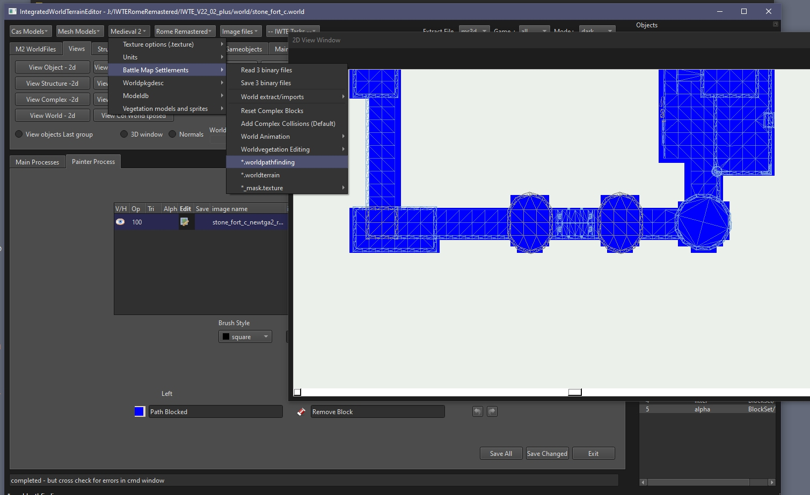

# M2TW .worldpathfinding file

Most .worlds in M2TW battlemaps uses a .worldpathfinding file, the file controls where troops can walk/stand.  Most techtree buildings do not have a .worldpathfinding file assigned, but they can have them added.

The .worldpathfinding for settlements includes blocked areas under walls and gates, these objects need to have 'breaches' assigned so that troops can cross them when the wall is destroyed or the gate opened.

See also:
* [M2TW Settlement Modding](M2_Settlement_Modding.md#m2tw-settlement-modding) - overview here
* [.worldpathfinding - M2TW](https://wiki.twcenter.net/index.php?title=.worldpathfinding_-_M2TW) - on TWC Wiki

#### Table of Contents

* [Editing .worldpathfinding via tgas](editing-worldpathfinding-via-tgas)
* [Resizing .worldpathfinding files](#resizing-worldpathfinding-files)
* [Editing .worldpathfinding in IWTE 2d window](#editing-worldpathfinding-in-iwte-2d-window)

## Editing .worldpathfinding via tgas

Use the screen/button ***Terrain1 > Create Pathfinding TGA2*** to convert an existing .worldpathfinding file to .tga representation.

The tga will show blocked areas in blue and open areas in green.  Use an image editing program to alter the areas of each colour to suit your new layout and save the tga.

Use the screen/button ***Terrain1 > Replace with Pfinding TGA2*** to create a revised .worldpathfinding file.  The new file will have had *_newtga2* added to its name.  Re-name the file as needed to use in game.

## Resizing .worldpathfinding files

Use the screen/button ***Terrain1 > Resize .worldpathfinding*** - the sizes are shown in the same way as for terrain files (rows and columns at 8m spacing) - approx 251 x 251 should cover the playable area of a battlemap.  The new file will have had *_resized* added to its name.  Re-name the file as needed to use in game.

## Editing .worldpathfinding in IWTE 2d window

If you edit a .worldpathfinding file in IWTE's 2d window you can load and view the .world file structures at the same time to easily tell which areas need to be blocked.

Files edited in the 2d window are saved to the IWTEsave directory.

