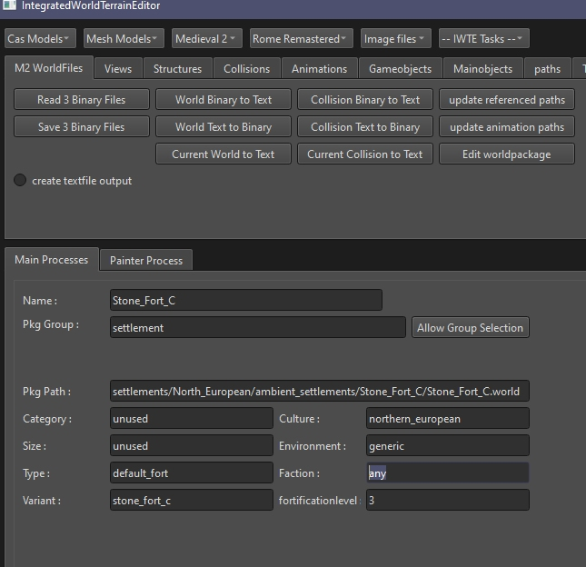
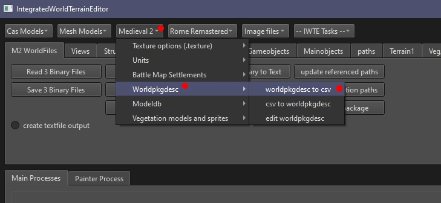
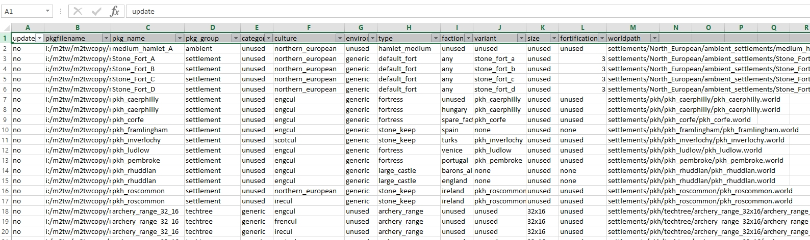

# .worldpkgdesc files in M2TW Settlement Modding
.worldpkgdesc files determine [which .world is used](M2_Settlement_Modding.md#which-world-is-loaded).  
More information about .worldpkgdesc files is provided on [TWC Wiki](https://wiki.twcenter.net/index.php?title=.worldpkgdesc_-_M2TW).

## Editing .worldpkgdesc files in IWTE screen
To edit a single .worldpkgdesc use the button *Edit worldpackage* on the M2 WorldFiles screen.

* Name can be anything, will appear in the battle editor selection
* Pkg Group - preset options only - press *Allow Group Selection* to activate the drop-down
* Pkg Path - path relative to data folder, must end in .world, .world file must exist there!
* Category - used for techtrees - see wiki
* Size - used for techtrees - see wiki
* Type - for settlements and forts - [see wiki](https://wiki.twcenter.net/index.php?title=.worldpkgdesc_-_M2TW#Type:)
* Variant - Mak can't remember
* Culture - any culture in your mod - see wiki for greek/ee issues
* Environment - unfortunately doesn't seem to do anything
* Faction - any faction in your mod
* Fortificationlevel - doesn't affect settlement walls

## Editing .worldpkgdesc files via csv

