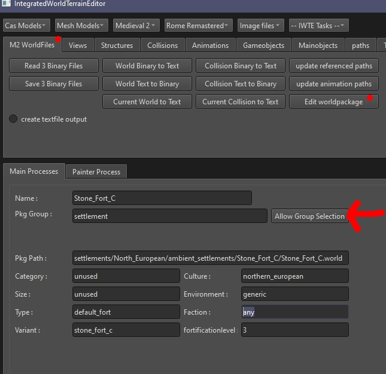

# .worldpkgdesc files in M2TW Settlement Modding
.worldpkgdesc files determine [which .world is used](M2_Settlement_Modding.md#which-world-is-loaded).  
More information about .worldpkgdesc files is provided on [TWC Wiki](https://wiki.twcenter.net/index.php?title=.worldpkgdesc_-_M2TW).

## Editing .worldpkgdesc files in IWTE screen

## Editing .worldpkgdesc files via csv

