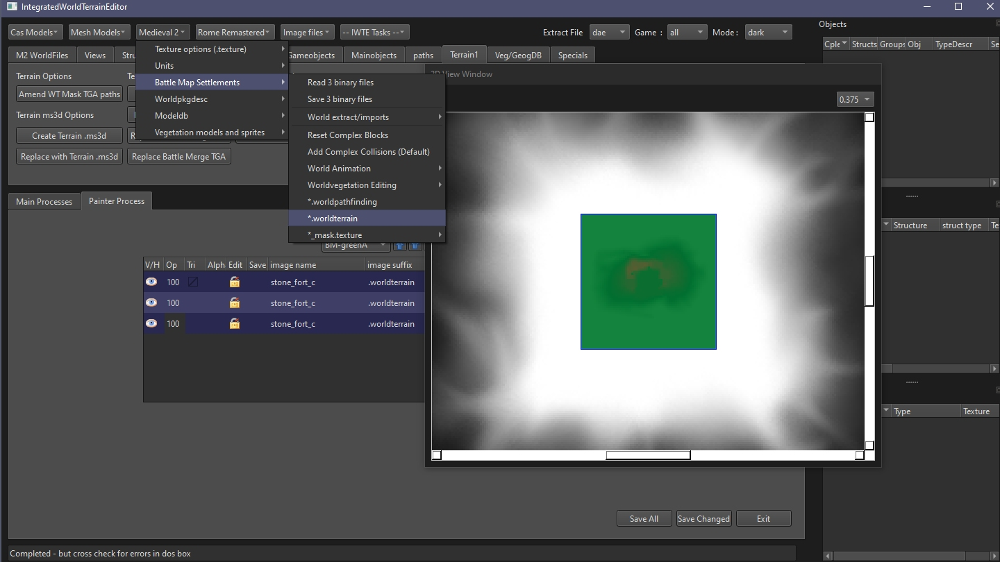

# M2TW .worldterrain file

Each .world (settlement, techtree, ambient or bridge) in M2TW battlemaps uses a .worldterrain file.  
The worldterrain controls the terrain heights and how they merge with surroundings, it also loads masks and textures that are applied to the ground surface.  The merge applied to the heights will also control how much of the information on the .worldvegetation is applied.

See also:
* [M2TW Settlement Modding](M2_Settlement_Modding.md#m2tw-settlement-modding) - overview here
* [M2 Terrain Mask Editing](Image_Editing_and_Conversion.md#m2-terrain-mask-editing)
* [Files loaded from .worldterrain](M2_Settlement_Modding.md#files-loaded-from-worldterrain)
* [.worldterrain - M2TW](https://wiki.twcenter.net/index.php?title=.worldterrain_-_M2TW) - on TWC Wiki

#### Table of Contents
* [.worldterrain file structure](#worldterrain-File-Structure)
* [Editing .worldterrain via tgas](editing-worldterrain-via-tgas)
* [Resizing .worldterrain files](#resizing-worldterrain-files)
* [Editing .worldterrain in IWTE 2d window](#editing-worldterrain-in-iwte-2d-window)
* [Editing .worldterrain in Blender](#editing-worldterrain-in-blender)

In addition to the editing methods mentioned on this page the worldterrain > ms3d and back option still exists, however we do not advise using ms3d due to size and other limitations.

## .worldterrain File Structure
There are up to three sections in a .worldterrain file:  
* heights - float values (+ or -) in a list for a specified number of rows and columns - applied by the game at 8 metre spacing
* terrain merge - float values between 0 to 1.0 in a list matching the heights numbers of rows and columns - used to merge the heights value, e.g. 1.0 terrain height fully applied, 0.0 terrain height ignored
* 'battle merge' - used in settlement terrains only (to give flat area for be-sieging attackers) - applies a notional flat plane at 0 height to extent of around 251x251 rows and columns of terrain - uses float values between 0 to 1.0 to control how this merges with underlying terrain

The heights contained in the .worldterrain are applied IN-GAME in an 8m grid with triangles patterned as shown.  This effect is not mod-able.

## Editing worldterrain via TGAs

To create .tga images representing the .worldterrain parts use the screen/buttons:  
***Terrain1 > Create Terrain TGA's***  
After selecting the .worldterrain you will see 3 height parameters, you can leave the default values in or modify them.  The height parameters may be needed as the process converts float values that allow fine detail to RGB values which only allow 0 to 255 values.
Adding more increments per height will increase the level of detail shown but mean the range might not extend far enough to show the highest/lowest areas.   MAKE A NOTE OF THE VALUES YOU USED IF DIFFERENT FROM THE DEFAULT!

Example tga files shown below have used a high value for increments per height, if that file is read back in by IWTE only the black/grey/white areas will be allowed to change the terrain file. The blue (too low) and the red (too high) will be ignored and original values retained in those areas.  Any area you are trying to edit needs to be in pure greyscale values, if you're using photoshop you could introduce a black and white filter mask to ensure you avoid any accidental merging.

When you've edited the tga files use screen/buttons:  
***Terrain1 > Replace Terrain * TGA***  

When you replace the base tga (the one with heights not merge values) you will be asked for the height TGA parameters, these must be the same as the ones used when creating the tga.

Each tga can only be read in individually, you will be asked for a .worldterrain file to modify each time.  If you need to change all three you can load them in sequence as follows;
* press **Replace Terrain Base TGA** button
* select original .worldterrain and then your **_wtbase**.tga
* file ending **_wtnewtga**.worldterrain will be written
* press **Replace Terrain Merge TGA** button
* select  _wtnewtga.worldterrain and then your **_wtmerge**.tga
* file ending _wtnewtga**_wtm**.worldterrain will be written
* press **Replace Battle Merge TGA** button
* select _wtnewtga_wtm.worldterrain and then your **_wtbattlemerge**.tga
* file ending _wtnewtga_wtm**_btm**.worldterrain will be written
* rename the final file as needed to be used in game
  

## Resizing worldterrain files

This is the only way to change the overall size (rows and columns) of a .worldterrain file, do not try and do it by changing the 2d or 3d representations.  Use the scree/button:
***Terrain1 > Resize .worldterrain***  
You will see the current size in the X/Y boxes, change these as desired.  If you are reducing the size of the .worldterrain you can use the button below to **Apply** merge distances, this will ensure the outside of the terrain merge is set to 0 (black in tga view) with a merge inwards to 1 (white).

## Editing worldterrain in IWTE 2d window

A complete .worldterrain file can be loaded in IWTE so the heights and merge elements can be viewed and edited alongside the .world file elements and terrain masks.  Use the screen/buttons:  
***Medieval 2 > Battle Map Settlements > .worldterrain*** to open the terrain file within IWTE

When you select the Edit option and zoom into to the 2d window you will be able to view the heights of each point.  If you load the 3 binaries for the .world and select *View World - 2d* for that you will see how the building mesh and other aspects relate.  There are various brush controls that allow you to edit each aspect of the terrain.  The heights element will also be viewable in the 3d window.

## Editing worldterrain in Blender

To extract a .worldterrain to work on in Blender, select either dae or glb in the *Extract File* box, then use the screen/buttons:  
***Medieval 2 > Battle Map Settlements > World extract/imports > Export Worldterrain***  

Import the file you have created into via the appropriate Blender import interface, Collada for .dae or glTF 2.0 for .glb.  
When working on the terrain file in Blender it is important not to move any vertexes along the x or y axis, you must only adjust the height (z axis).  Most tools in Blender have options that allow you to lock x and y, or activate only z.  Optionally you can also import buildings from your settlement into the same file.  IWTE will look for and separate the mesh names worldterrain for re-import.

When finished export to .dae or .glb from Blender, and use the Import Worldterrain function in IWTE.  You will be asked for a .worldterrain file to update first, this is required as the dae/glb does not store the mesh or merge information, only heights.

