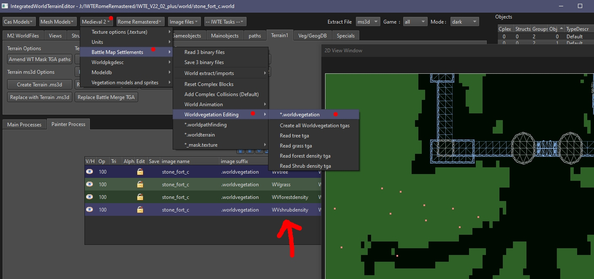

# M2TW .worldvegetation file

All .worlds in M2TW battlemaps use a .worldvegetation file, the file controls where grass, trees and shrubs are shown.  There are four sections to the file that control respectively:

* individual trees
* grass
* forest density
* shrub density

These elements will only appear if the climate the battle is being played on has them, as specified and controlled by the [vegetation.db](M2_vegetation_db.md) and distribution in [geography.db](geography_db.md#m2-specific-elements).  The individual trees and forest density sections will produce the same selection of tree models, the individual tree section simply allows you to align them more specifically, e.g. if you want a tree to appear in a planting box.

#### Table of Contents

* [Editing .worldvegetation via tgas](editing-worldvegetation-via-tgas)
* [Resizing .worldvegetation files](#resizing-worldvegetation-files)
* [Editing .worldvegetation in IWTE 2d window](#editing-worldvegetation-in-iwte-2d-window)

See also:
* [M2TW Settlement Modding](M2_Settlement_Modding.md#m2tw-settlement-modding) - overview here

## Editing .worldvegetation via tgas

## Resizing .worldvegetation files

Use the screen/button ***Terrain1 > Resize .worldvegetation*** - the sizes are shown in the same way as for terrain files (rows and columns at 8m spacing) - the vegetation file size should match the terrain file size, mismatches can crash the game on battle load.  

The new file will have had *_resized* added to its name.  Re-name the file as needed to use in game.

## Editing .worldvegetation in IWTE 2d window

If you edit a .worldvegetation file in IWTE's 2d window you can load and view the .world file structures at the same time.
The 4 layers have names that indicate which elements they control.

Files edited in the 2d window are saved to the IWTEsave directory.
