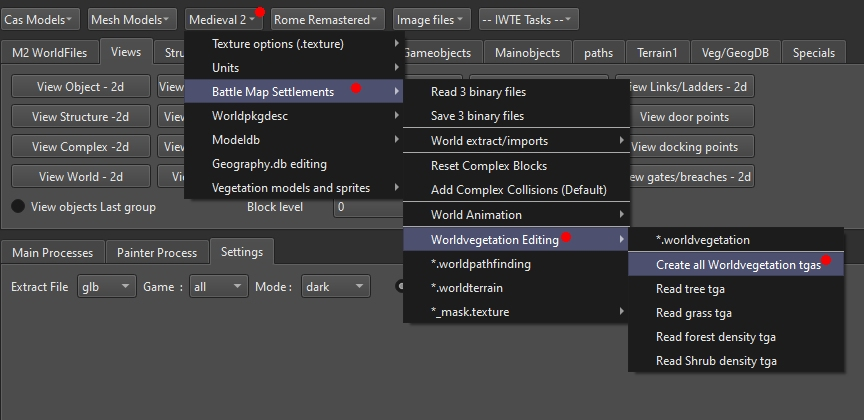

# M2TW .worldvegetation file

All .worlds in M2TW battlemaps use a .worldvegetation file, the file controls where grass, trees and shrubs are shown.  There are four sections to the file that control respectively:

* individual trees
* grass
* forest density
* shrub density

These elements will only appear if the climate the battle is being played on has them, as specified and controlled by the [vegetation.db](M2_vegetation_db.md) and distribution in [geography.db](geography_db.md#m2-specific-elements).  The individual trees and forest density sections will produce the same selection of tree models, the individual tree section simply allows you to align them more specifically, e.g. if you want a tree to appear in a planting box.

#### Table of Contents

* [Editing .worldvegetation in IWTE 2d window](#editing-worldvegetation-in-iwte-2d-window)
* [Editing .worldvegetation via tgas](editing-worldvegetation-via-tgas)
* [Resizing .worldvegetation files](#resizing-worldvegetation-files)

See also:
* [M2TW Settlement Modding](M2_Settlement_Modding.md#m2tw-settlement-modding) - overview

## Editing .worldvegetation in IWTE 2d window

If you edit a .worldvegetation file in IWTE's 2d window you can load and view the .world file structures at the same time.
The 4 layers have names that indicate which elements they control.

The 4 layers can be edited individually, and visibility and/or opacity turned on/off to aid viewing.  The settlement's [.worldpathfinding](M2_worldpathfinding.md) and [.worldterrain](M2_worldterrain.md) files can also be loaded simultaneoulsy for comparison or editing. Files edited in the 2d window and saved will generate a new .worldvegetation file in the IWTEsave directory.

## Editing .worldvegetation via tgas

Use **Medieval 2 > Battle Map Settlements > Worldvegetation Editing > Create all Worldvegetation tgas** and select your .worldvegetation file to get IWTE to make .tga representations of each .worldvegetation section.

The .tgas produced will be in the same folder as your .worldvegetation and named as follows:
* *file_name_tree_veg.tga* - single orange pixels for tree locations
* *file_name_grass_veg.tga* - light green for grass, dark green or black for no grass
* *file_name_forest_veg.tga* - grayscale with black for no forest
* *file_name_shrub_veg.tga* - grayscale with black for no shrubs

Amend the tga files as required and load them back in individually using the **Read (veg type) tga** buttons.  You will be asked for a .worldvegetation file to load into on each read tga process. Make sure you load the .worldvegetation that already has your amended information. e.g:
* press Read tree tga
* select *file_name.worldvegetation*
* select your tree_veg.tga
* *file_name_**new_tree**.worldvegetation* will be produced
* press Read grass tga
* select *file_name_**new_tree**.worldvegetation*
* select your grass_veg.tga
* *file_name_new_tree_**new_grass**.worldvegetation* will be produced, etc.
When you have all the changes you want re-name the last .worldvegetation file so it can be used in game.

## Resizing .worldvegetation files

Use the screen/button ***Terrain1 > Resize .worldvegetation*** - the sizes are shown in the same way as for terrain files (rows and columns at 8m spacing) - the vegetation file size should match the terrain file size, mismatches can crash the game on battle load.  

The new file will have had *_resized* added to its name.  Re-name the file as needed to use in game.

