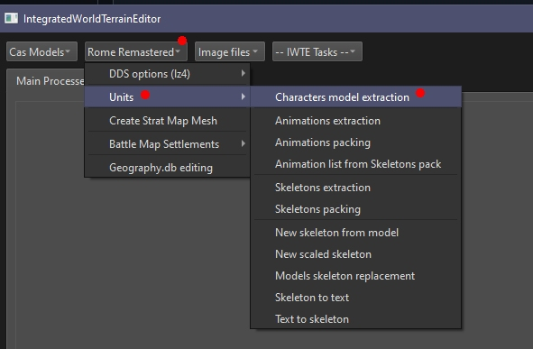

# Extracting .cas Files from Character Packs in Rome Remastered

IWTE provides a viewer for selecting models included in the Rome Remastered character packs and extracting them to .cas and .dae or .glb.

Feral provide an alternative method see https://github.com/FeralInteractive/romeremastered/blob/main/tools/unpack_characters/unpack_characters.md

The .cas files provided will be the same whether using the IWTE or Feral method. The pack files are simply the binary .cas files appended together, they are not compressed or modified.

To launch the process use the buttons:  
***Rome Remastered > Units > Characters model extraction***  
Navigate to the folder containing the .pak files, probably  
*C:\Steam\steamapps\common\Total War ROME REMASTERED\Contents\Resources\Data\data\characters\packs*
then navigate to the folder you want any extracted files to be written to    
please now wait while IWTE reads the packs

When the packs have been read the left hand screen will be populated with all the available .cas files  
Select the ones you want and the **Add** them to the right hand panel  
You can use the Wildcard or Fixed String filters to help find the files you want (these take a while to apply due to number of models)  
Select the file type you want produced  
* glb - will give you .cas files and .glb files (for use in Blender 4.2+)
* dae - will give you .cas files and .dae files (for use in Blender 4.1 or earlier)
* cas - will give you only .cas files
  
Press OK to process selected files  
Press Cancel to close the packs  

Note that Rome Remastered also has readily accessible unit/figure related .cas files in data/animals, data/characters, data/models_strat and data/models_engine
