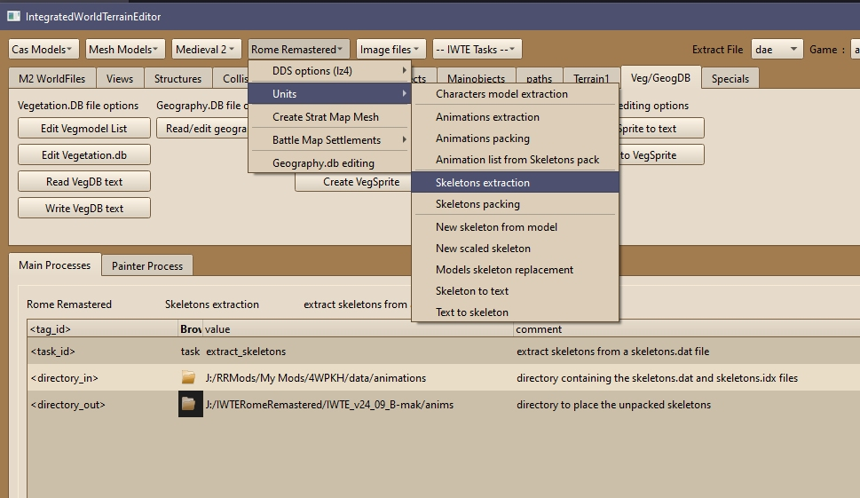

# Rome Remastered Skeletons and Animations

The Rome Remastered skeletons and animations are broadly similar to the OG RTW ones. Differences include:
* Voice/sound bank changes inside skeletons
* Different pack version number
* 2 additional anims per skeleton
* Additional anims added via descr_skeleton_feral_overrides.txt and not 'packed' - these are the same format as the packed chunks extracted from packs.dat
* Scaling process is different:
  * RR does not use differently scaled anims within the pack files. For packed anims the skeleton scale is simply applied to them. This avoids the problems of working with unpacked animations where differently scaled anims with the same name overwrite each other.
  * However, this scaling system DOES NOT work for the .anim files used via descr_skeleton_feral_overrides.txt. If you want a scaled skeleton to use an override animation you need to make yourself a new .anim with the same scale as the skeleton. 
* Mods only require additional/changed skeletons/anims - modders do not need to include all vanilla content in their packs

Some of these changes make it impractical to use the same tools as for RTW skeletons, so you can either use IWTE and work with the RR format, or work with the old RTW format/files and convert using Feral's [Skeleton Converter](https://github.com/FeralInteractive/romeremastered/blob/main/tools/SkeletonConverter/SkeletonConverter.md).

## Skeleton Unpacking with IWTE
To unpack skeletons use buttons:  
***Rome Remastered > Units > Skeletons extraction***  
Select the folder where your skeletons.dat and skeletons.idx are located. Select the folder where you want the extracted files to be written. 

## Working with Skeleton Files
The unpacked skeletons are simply the relevant binary chunk of the skeletons.dat written out as an individual binary file. To create a version of a skeleton that you can read and work on use the buttons:  
***Rome Remastered > Units > Skeleton to text***  
That will get you a text file called *original_name_textformat.txt*.  The skeleton file will start with the bone data, e.g.:

       1.0000                                                   # skeleton scale 
    19                                                          # number of bones 
    0                                                           # bone count 2
       0.5000                                                   # lerp float 
       0    0.0000    0.0000    0.0000  -1   0   0              # bone idx 0
       0    0.0952    0.0008    0.0000   0   0   0              # bone idx 1
       0    0.0234   -0.4646   -0.0050   1   0   0              # bone idx 2
       0    0.0232   -0.4006   -0.0124   2   0   0              # bone idx 3
       0   -0.0000    0.2125   -0.0000   0   1   1              # bone idx 4
       0   -0.0003    0.2116    0.0000   4   1   1              # bone idx 5
       0   -0.0001    0.2350    0.0000   5   1   0              # bone idx 6
       0    0.0040   -0.0843   -0.2040   5   1   0              # bone idx 7
       0    0.0000   -0.2603   -0.0697   7   1   0              # bone idx 8
       0    0.0000   -0.2600   -0.0697   8   0   0              # bone idx 9
       0    0.1786    0.0782   -0.0239   5   1   0              # bone idx 10
       0    0.3022    0.0111   -0.0138  10   1   0              # bone idx 11
       5    0.2838   -0.0030    0.0264  11   1   0              # bone idx 12
       0   -0.1780    0.0782   -0.0239   5   0   0              # bone idx 13
       0   -0.3022    0.0111   -0.0138  13   0   0              # bone idx 14
       4   -0.2838   -0.0030    0.0264  14   0   0              # bone idx 15
       0   -0.0952    0.0008    0.0000   0   1   0              # bone idx 16
       0   -0.0234   -0.4646   -0.0050  16   0   0              # bone idx 17
       0   -0.0232   -0.4006   -0.0124  17   0   0              # bone idx 18

The table section for the bones works as follows;
* column 1 - special bone indicator - certain bones such as the hands in units and saddle bones in mounts have an indicator number
* columns 2,3,4 - x,y,z coordinates **RELATIVE TO THE PARENT BONE**
* column 5 - bone index for that bone's parent bone - so 0 for bones parented to bone_pelvis in units
* columns 6,7 - indicators related to special functions - these appear to activate the ability of bones to follow terrain/enemy movement but only work in RR RTW version not under RR BI version!
RR and RTW unit skeletons will accept a maximum of 24 bones.

After the bone data the animations are listed;

      <ANIM_READY_TO_STAND>                     "data/animations/LID_48_Standing ready 2 STAND.cas"        # anim  26
      anim_data      0   0.0000  0.0000  1.6000    0    0.0000    10   179    0.0000    0.0000    1.0000   # resetangle, impact xyz, impact frame, distance(look up animation), turn (deg) min/max, launch xyz 
      event "FOOTSTEP"      "walk"                   14     15                                             # event type, subtype, frame start/end RANDOM, LOOPED 
      <ANIM_READY>                              "data/animations/LID_02_Standing Ready.cas"                # anim  27
      anim_data      0   0.0000  0.0000  1.6000    0    0.0000    10   179    0.0000    0.0000    1.0000   # resetangle, impact xyz, impact frame, distance(look up animation), turn (deg) min/max, launch xyz 
      <ANIM_READY_IDLE_1>                                                                                  # anim  28
      <ANIM_READY_IDLE_2>                                                                                  # anim  29

The example section above shows that **anim ready_to_stand** uses the animation *data/animations/LID_48_Standing ready 2 STAND.cas* and plays the sound assigned to the event *footstep, walk* between frames 14/15.  Other settings are explained in the comments after the # symbol.

In the above section no animations are assigned to ready_idle_1 or ready_idle_2.  You could add animations for those settings by copying the format used for similar animations and adding your animation name/path.

The list of possible animations should be evident from the file but is also available on TWC Wiki [here](https://wiki.twcenter.net/index.php?title=Rome:_Total_War%27s_Animation_Modification).  Some animations will be definitely required for certain unit/character types and functions.  Other animations such as numbered idle versions may be optional.  Adding a new animation to a skeleton does not guarantee that it will be used in game.  Do not forget to check the game's message log to see if it is objecting to an unwanted or missing animation.

The file ends with speeds, 0/1 for 'uses missile' and 0/1 for 'can turn in place'  

         1.8240    5.0000    6.8309                              # walk, run, charge speeds
    0                                                            # uses missile 
    1                                                            # can turn in place 

## Animations Unpacking with IWTE
To unpack skeletons use buttons:  
***Rome Remastered > Units > Animations extraction***  
Select the folder where your pack.dat and pack.idx are located. Select the folder where you want the extracted files to be written. 
