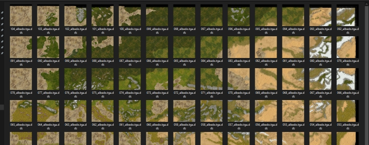
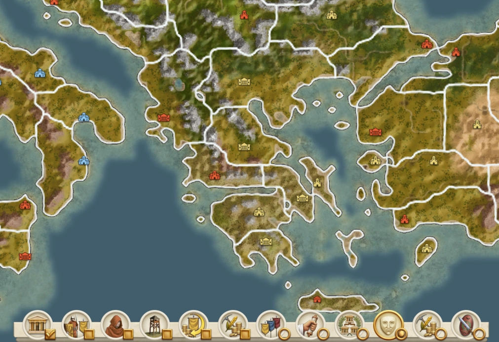

# Creating Feral 2d map and radar maps

IWTE will create a feral 2d map and radar map for summer and winter based on appending together albedo textures it has generated in the mesh creation process.  See example task file [RR_create_map_fe_task.txt](https://github.com/makanyane/IWTE/blob/main/task_file_examples/RR_create_map_fe_task.txt)

The mesh and albedo process must have been run first. the <directory_in> should be the folder where the existing albedos, albedos_winter and materials folders are located. The <map_pieces_longest_dimension> should be the same as used to generate the mesh. The map_heights, map_regions and map_ground_types.tga files USED IN GAME are needed so IWTE can work out where the game will think the coastline is and adapt the alpha layer accordingly.*

If you're running this on an existing mod and don't know what the <map_pieces_longest_dimension> was, you should be able to work it out by viewing the albedos file as icons, viewed in reverse name order and adjusted until things line up. (Also check the total number of pieces divides by the number!)

Picture below is of the albedos from a Mundus Magnus mod and it ended up as 13 tiles across the longest dimension:

IWTE will append the dds files previously produced for albedos together, some shading is also applied taken from the information in the previously produced materials, the alpha layer is created from information in the map_*.tga files requested.  The sea colour is added with varying opacity according to the sea ground_types.

Summer and winter versions sized to suit the Feral 2d map and the radar map will be produced.  The large feral maps need to be converted from .tga.tga to .tga.dds before copying into the game.

*Many thanks to Suppanut on Discord for research into how the 2d map relates to regions.
