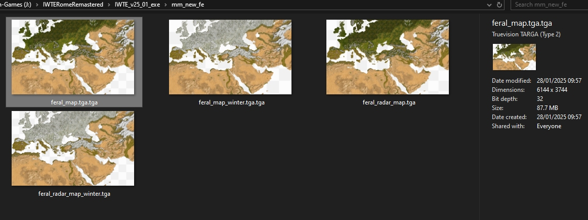

# Creating Feral 2d map and radar maps

IWTE will create a feral 2d map and radar map for summer and winter based on appending together albedo textures it has generated in the mesh creation process.

The mesh and albedo process must have been run first. the directory in should be the folder where the albedo and albedo_winter folders are located.

The 'pieces longest dimension' should be the same as used to generate the mesh.

An example of the task file needed to run the process can be found here:  
https://github.com/makanyane/IWTE/blob/main/task_file_examples/RR_create_map_fe_task.txt

IWTE will append the dds files previously produced for albedos together, some shading is also applied taken from the information in the previously produced materials, the alpha layer is created from information in the map_*.tga files requested.

Summer and winter versions sized to suit the Feral 2d map and the radar map will be produced.
