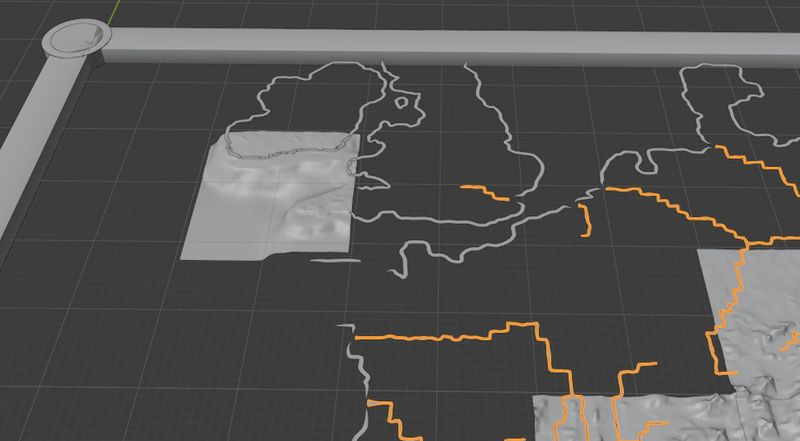

# The Rome Remastered campaign map

The RR campaign map (3d view) is not generated 'on the fly' as with RTW and M2TW. It requires various mesh components and textures to be made by the modder.

#### Table of Contents
* [About the Rome Remastered campaign map](#about-the-rome-remastered-campaign-map)
* [Rome Remastered map making using IWTE](#rome-remastered-map-making-using-iwte)
* [Options](#Options)
* [Version _V2 task file settings](#version-_v2-task-file-settings)
* [Changing textures](#changing-textures)
* [Region Boundaries at Rivers](#region-boundaries-at-rivers)
* [Large Maps with a Large Number of Textures](#large-maps-with-a-large-number-of-textures)

## About the Rome Remastered campaign map

The picture below shows some of the components of the 3d map converted and opened in Blender

 The components required include:
* mesh pieces
* albedo textures for summer and winter
* normal textures
* coastline mesh/meshes
* river mesh
* frame and textures 
* map tiles and coastlines text files

More information about the map is available on [TWC Wiki](https://wiki.twcenter.net/index.php?title=Creating_New_Campaign_Map_in_Rome_Remastered).

## Rome Remastered map making using IWTE

IWTE will produce all the map components based on the data/world/maps/ tga files and your choice of input textures and settings.  The simplest version involves just pressing a button and choosing two folders, see [RR_map_mesh_simple_method.md](https://github.com/makanyane/IWTE/blob/main/documentation/RR_map_mesh_simple_method.md)

Running that process from the button will generate a task file with the task ID **create_map_pieces_v2** for you,  which you can use to repeat the same process or amend to adjust settings.

To create the large 2d map and radar maps also needed in game see [RR_map_mesh_create_feral_map.md](https://github.com/makanyane/IWTE/blob/main/documentation/RR_map_mesh_create_feral_map.md) 

## Options

IWTE's original version of the map mesh process was released soon after Rome Remastered.  V2 is more recent and by default uses some textures built into IWTE which attempt to emulate a vanilla feel on the map. For details of the differences between the versions and more about the original version see [RR_map_mesh_versions.md](https://github.com/makanyane/IWTE/blob/main/documentation/RR_map_mesh_versions.md)

As the map mesh can vary from a strict interpretation of the campaign map_*.tga files IWTE introduced several new features that allow more variety, including a 'map_heights_lakes.tga' that is used to avoid coastlines and excessive sinking of inland lakes, and dummy map climates that can be used to alter the albedo textures generated.  Dummy climates are an example of giving IWTE different data to that which will be used in game, this is fine but should be used with caution in case it confuses players about where they can move, or what they should expect on a battle map.

Both map generation processes contain options to accentuate certain features and/or change the textures to take heights and slopes into account.

## Version _V2 task file settings

    <task_id>   create_map_pieces_v2

See task file example:  
* [RR_MAP_MESH_v2_vanilla_style_textures_task.txt](https://github.com/makanyane/IWTE/blob/main/task_file_examples/RR_MAP_MESH_v2_vanilla_style_textures_task.txt) - shows optional tags for altering various settings

Optional tags:
* <river_drop_height> - to reduce amount of river_mesh required see [RR_map_mesh_rivers.md](https://github.com/makanyane/IWTE/blob/main/documentation/RR_map_mesh_rivers.md)

## Changing textures 

See task file example:  
* [RR_MAP_MESH_v2_modified_textures_task.txt](https://github.com/makanyane/IWTE/blob/main/task_file_examples/RR_MAP_MESH_v2_modified_textures_task.txt) - uses default settings but adds reference to separate textures file

To change the textures used away from the default textures and setup included in IWTE.exe add a tag and path to your task file, e.g.
	<strat_map_texture_descr>        "D:\IWTE_folder\my_strat_map_texture_descr.txt"  
If you use a relative path like  
	<strat_map_texture_descr>        "\my_folder\my_strat_map_texture_descr.txt"  
that path will be RELATIVE TO THE LOCATION OF THE IWTE EXE

The text file specified will then control the textures used for each climate/ground_type/height_zone combination.

Some example text files are provided here:
* [RR_MAP_v2_TEXTURES_vanilla_example_texture_descr.txt](https://github.com/makanyane/IWTE/blob/main/documentation/misc_files/RR_MAP_v2_TEXTURES_vanilla_example_texture_descr.txt) - is very similar to the default texture set-up included INSIDE IWTE.exe
* [RR_MAP_v2_TEXTURES_basic_example_texture_descr.txt](https://github.com/makanyane/IWTE/blob/main/documentation/misc_files/RR_MAP_v2_TEXTURES_basic_example_texture_descr.txt) - is a reduced version to show what can be omitted if you do not wish to take advantage of height zones or the ridge/peak/valley/flat additional 'ground_types'
* [RR_MAP_v2_TEXTURES_own_textures_example_texture_descr.txt](https://github.com/makanyane/IWTE/blob/main/documentation/misc_files/RR_MAP_v2_TEXTURES_own_textures_example_texture_descr.txt) - shows what a simple file using some of the new ground_type tags and your own textures could look like - the example is from a work-in-progress mod based on Britain, the climate variations are minimal so the climate default textures are used for most climates except where variations such as white cliffs are required

Paths inside the texture descr files are relative, those starting \iwtepack will look inside the IWTE.exe regardless of the location of the texture descr file, all other paths will be RELATIVE TO THE TEXTURE DESCR FILE.

### Recommended Further Reading (V2)
TWC Wiki:	https://wiki.twcenter.net/index.php?title=IWTE_-_Rome_Remastered_Functions

## Region Boundaries at Rivers
For region boundaries that align properly with rivers you WILL NEED to add in the supplied  
*descr_aerial_map_tile_models.txt*  

text file into the folder:  
*...mod_name/data/*   

and add the supplied or created  
*rivers_a.cas*  

file to the folder:  
*...mod_name/data/terrain/aerial_map/tile_models/river_a*  

Ignoring both files will result in misalignment between rivers and region borders, adding one but not both will result in very messed up region borders!

## Large Maps with a Large Number of Textures
Very large maps which have hundreds of piece tiles may get the dissappearing frame bug due to too many textures.  

    <task_id>     combine_piece_textures  
task can be used to join 4 adjoining textures into one - as part of the process IWTE will modify the cas pieces uv mapping and produce the desc_map_tiles.txt file required to assign 4 tiles to the same texture.

