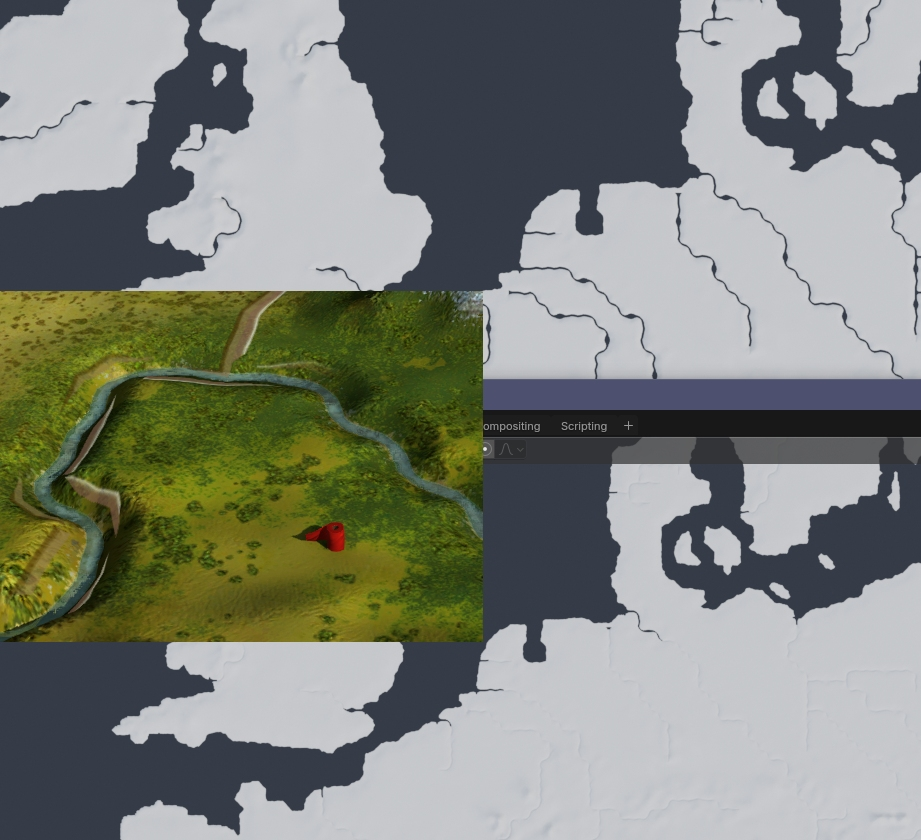

# Rivers in the Rome Remastered map mesh

See also:
* [RR_Map_Mesh_Production.md](RR_Map_Mesh_Production.md)

RR 3d map has two ways of rendering water;  
* 'sea' - a plane that extends throughout the map at height 0 and renders as looking like water - cannot be modded
* 'rivers' - ONE .cas mesh, *data/terrain/campaign/campaign_name/river_mesh.cas* renders as looking like water, can only contain one mesh and maximum approx 60k verts/tris

The limitation on the size of the river_mesh.cas can cause problems if you have a very large map and a lot of rivers.

IWTE will automatically stop producing river_mesh pieces where it detects that the base of the river is below the sea plane.  If you still have problems with too many river sections to fit into the .cas you can use the task tag:  
 <river_drop_height>            2.0 
and adjust the value until enough river is dropped to allow the mesh cas to be created.

The picture below shows a mesh with default settings and a mesh with a river_drop_height of 50.0.  A plane at 0 height has been added so you can view how the sea plane would intersect.  The inset view from the map loaded in game shows the sort of canyon effect this can produce if you use a high drop value.

The  <river_drop_height> tag works in both the original and V2 map mesh creation processes.
