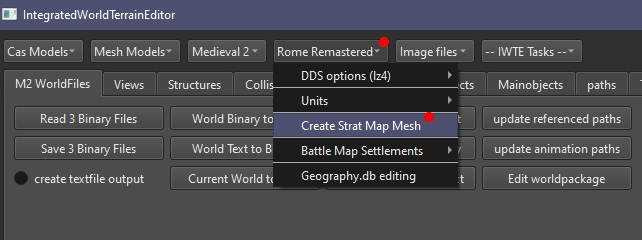

## Simple Rome Remastered map mesh using IWTE

IWTE will produce all the map components based on the data/world/maps/ tga files and default input textures packed inside the IWTE.exe.

The simplest possible version of this process can be run from the buttons:   
**IWTE > Rome Remastered > Create Strat Map Mesh**

This will produce the mesh and all necessary components with vanilla style textures.  
The only inputs required are:
* The FOLDER containing your;  
  * map_regions.tga
  * map_features.tga
  * map_heights.tga
  * map_ground_types.tga
  * map_climates.tga
  * map_snow.tga		(optional - if you want snow applied to your winter textures)
  * map_heights_lakes.tga	(optional - use if you want lakes shown on the mesh higher than sea level and without surf) 
* The FOLDER you want the output written in - if this folder has the same name as your campaign folder the text files will be created with the correct path.  If you use a differently named folder you will have to manually edit the descr_map_coastlines.txt and descr_map_tiles.txt.  If you specify the actual folder:  
	*your_mod/data/terrain/campaign/campaign_name*
then all the files will be placed directly in position ready to be used in game.

Running the process from the button will generate a task file with the task ID **create_map_pieces_v2** for you,  which you can use to repeat the same process or amend to adjust settings.  See [RR_map_mesh_production.md](https://github.com/makanyane/IWTE/blob/main/documentation/RR_map_mesh_production.md) for more details.

To create the large 2d map and radar maps also needed in game see [RR_map_mesh_create_feral_map.md](https://github.com/makanyane/IWTE/blob/main/documentation/RR_map_mesh_create_feral_map.md) 

### Region Boundaries at Rivers
For region boundaries that align properly with rivers you should copy the *descr_aerial_map_tile_models.txt* and *river_a.cas* supplied in the IWTE folder into your mod on these paths:  

*...mod_name/data/descr_aerial_map_tile_models.txt*    
  
*...mod_name/data/terrain/aerial_map/tile_models/river_a/rivers_a.cas* 

Ignoring both files will result in misalignment between rivers and region borders, adding one but not both will result in very messed up region borders!

