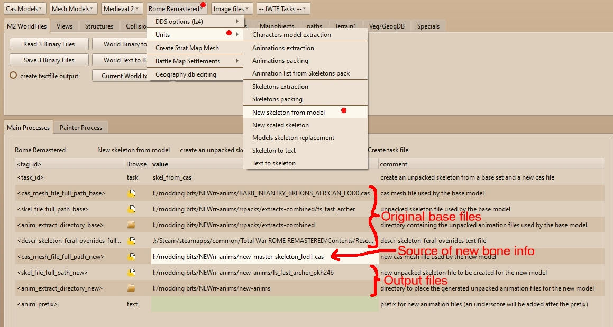
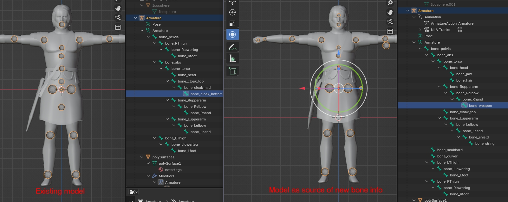

# Rome Remastered - New Skeleton from Model

The process takes bone information from an existing model, compares with bone information from a new model and converts the existing skeleton and animations to match the new model.  Start the process using the buttons:  
** Rome Remastered > Units > New skeleton from model **

This will open a form table for you to browse to the directories you want and/or type in information as shown below:

The <anim_prefix> section is optional, using it will add the prefix before all the newly generated animation names and include the altered names in the new skeleton file.

The process has to work from before and after unit .cas models as they are the only element that stores the bone names.  Bone names are needed so IWTE can retain information from the anims, e.g. any movements that bone_Relbow had in the original anims will be transferred to bone_Relbow in the new animations.  Movements for bones which do not exist with the same name in the new animation will be deleted. No movements will be applied to bones with new names.  The picture below shows an example of before and after unit models.  Only the Armature structure is relavent for this process.

## New skeleton from model via task file

**<task_id>              skel_from_cas**   

Running the process from the buttons and form will generate an iwte_skel_from_cas_rr_task.txt file.  You will probably find this easier to use and ammend to use for other skeletons.

## Differentiating new anims

If you are changing the bone structure of an animation set you are unlikely to want to overwrite vanilla animations.  Adding the <anim_prefix> can help avoid this, but you will want to avoid ending up with multiple prefixes on the anim names, you also need to ensure that slight variants e.g. the _fast or _slow versions of skeletons don't end up using animations with different names that are actually identical in content.

As an alternative to using prefixes you can keep the anim names and paths mostly the same but add a mod_name folder, e.g. if the animation path would have been:  

    data/animations/lij/LIJ 01 Stand idle 03.cas  
you can insert a folder when moving your new anims into position and use  

    data/animations/my_mod_name/lij/LIJ 01 Stand idle 03.cas 
the */my_mod_name* folder should also be added to the paths in the skeleton before packing by converting to text, editing, and converting back, see [RR_Skeletons_and_Animations.md#working-with-skeleton-files](RR_Skeletons_and_Animations.md#working-with-skeleton-files)
