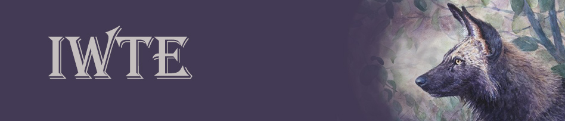

# Rome Remastered - New Skeleton from Model

The process takes bone information from an existing model, compares with bone information from a new model and converts the existing skeleton and animations to match the new model.

