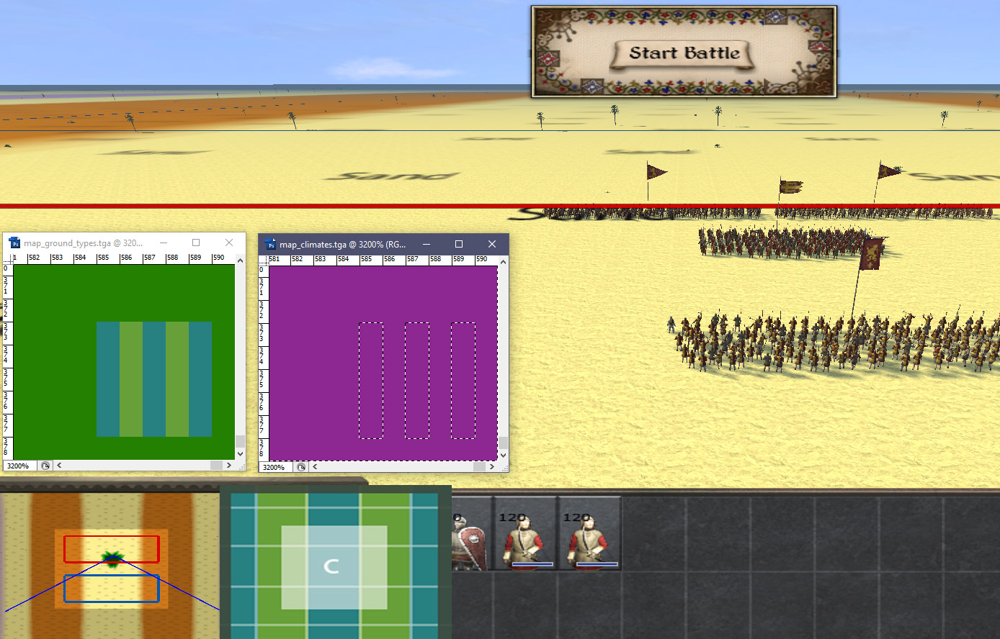
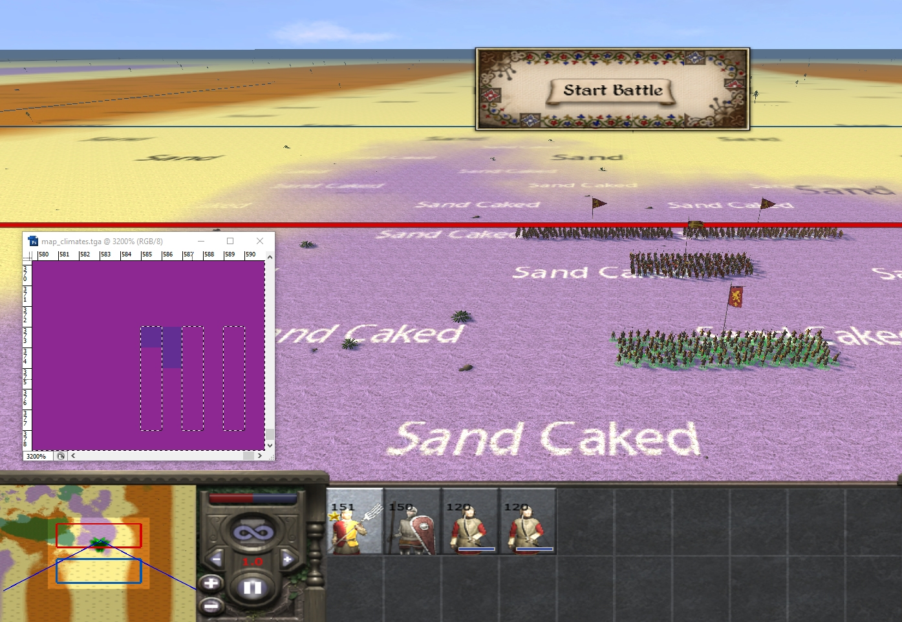
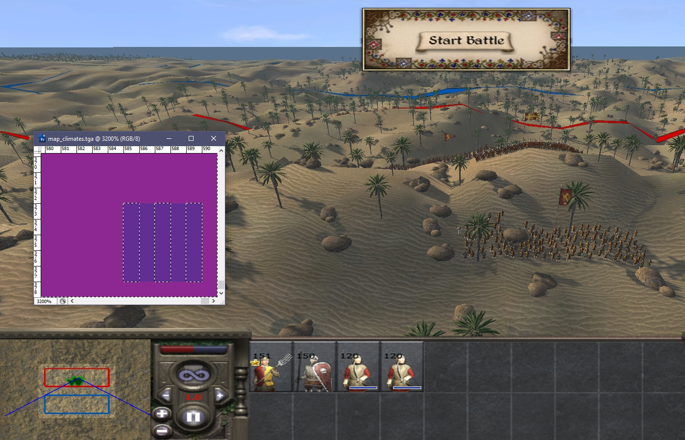
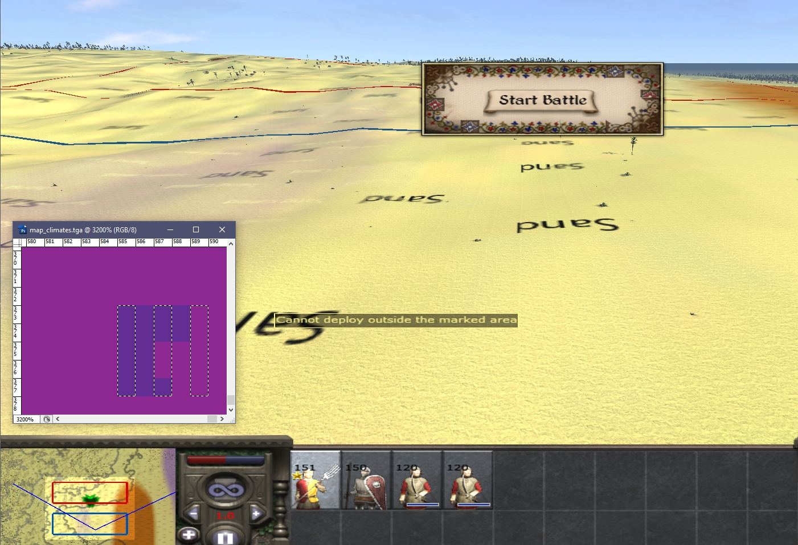

# Strat map to battle map conversion

This article uses images from M2TW but similar principles (except vegetation distribution) apply in RTW/RR.

IWTE was used to change the geography.db settings for demonstration purposes.  It's quite hard to identify where changes to the battle map come from unless you remove a lot of variability from the climate/s you are testing!

The picture below shows our test battlfield which is completely flat in map_heights and has ground_type stripes of fertility_low and fertility_medium. In this pic the climate is rocky_desert which has been set up to have no ground_type or height variation and to use bright coloured battlefield textures with their names added:

The added overlay by the mini-map attempts to show how the strat map ground types are influencing the map.

Adding some pixels of sandy desert climate results in the picture below.  The textures used are still from rocky desert but the ground type variation factors in the corner have been picked up from sandy desert's settings.

In the image below the climate has been switched to only include sandy desert. Sandy desert has been altered in the geography.db to have a very obvious height variation applied, and distribution of forest and rocks increased. 

Reverting the 'control square', the odd,odd pixel in map_climates.tga where the battle is being fought, to rocky desert, but leaving the surrounds as sandy desert gives this result:

You'll note that the textures have all reverted to the named ones used by rocky desert but most of the battlemap is using sandy desert's height variation and vegetation distribution.

Reducing the amount of sandy desert on the right hand side of the battle map allows the no-variation settings of the rocky desert area to become apparent again:

