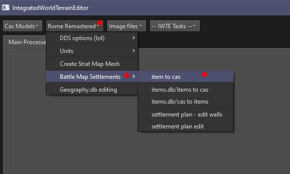
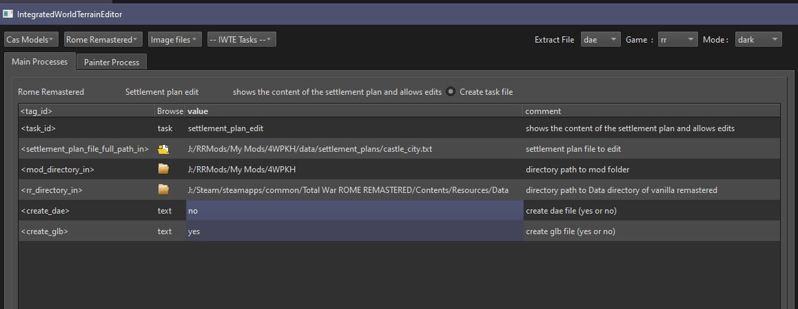
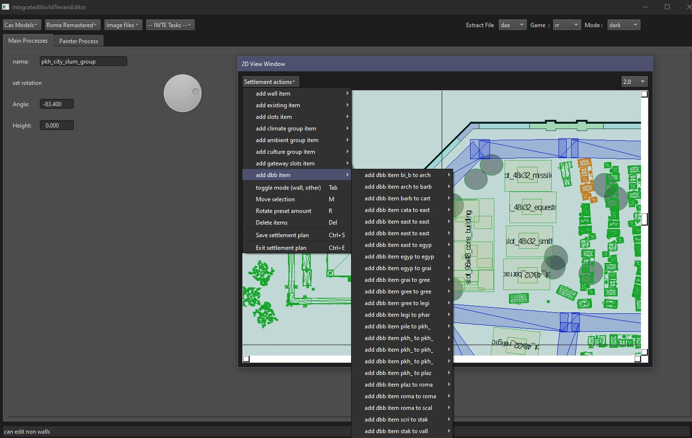
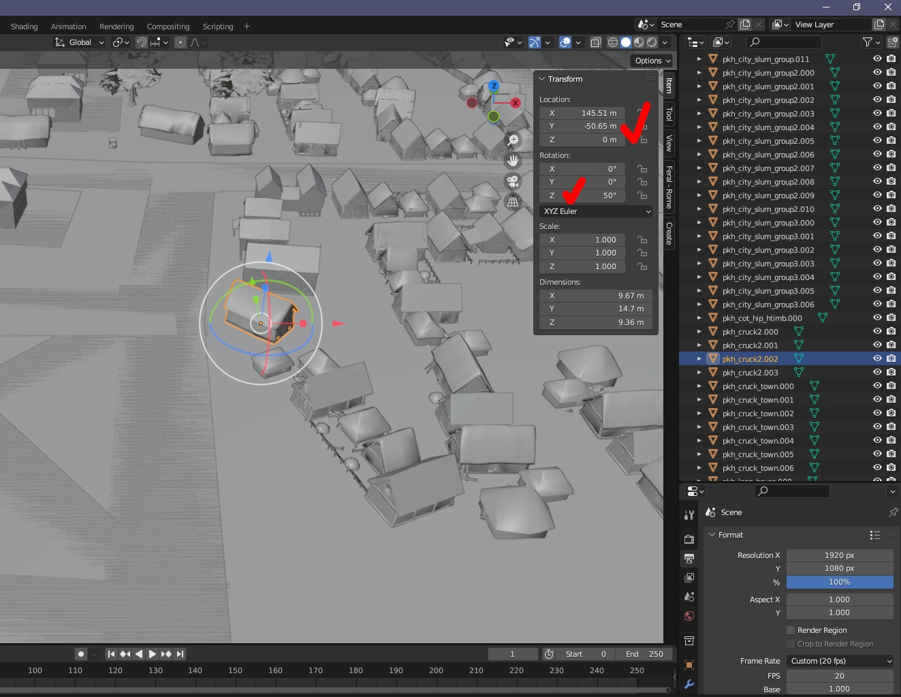

# Battlemap Settlement Editing - RR and RTW

Battlemap Settlements in RR and RTW are created and modified via settlement plans in text format.  The settlement plans list positions of wall sections, dbb entries and other components.  The components used originate as models in .cas format. Some .cas files are converted by the game into .item files or .bpi files.

## Item to Cas Conversion with IWTE

Some RTW mods were released with new buildings in the final .item format but .cas files were not supplied, additionally some RTW OG building .cas files were in an old .cas format which isn't read by the conversion tools.  The item to cas functions are supplied to allow modders to retrieve .cas files they can work on from .items

The functions are accessible via buttons.

*Rome Remastered > Battle Map Settlements > item to cas* allows you to select a single .item file for conversion.  The resultant .cas files will be written to sub-folders below your .item location called *anyoutfiles/models_building*. If the .item had multiple lod levels they will be written out to separate .cas files.

*Rome Remastered > Battle Map Settlements > items.db/items to cas* requires you to select the *descr_items.db* file, which should be in the folder above the *items* folder.  All the .items listed in the .db file will be converted if found. The resultant .cas files will be written to a folder called *to_cas* and will be arranged in the sub-folders specified by the items.db file.

*Rome Remastered > Battle Map Settlements > items.db/cas to items* also requires you to select the *descr_items.db* file, you must therefore have already run the game process to regenerate the .db.  IWTE will convert the listed cas files to items which will be placed in a folder called *to_item*.   **NOTE!!!  You only need IWTE generated .item files if you have animated spot_fx files and have problems with the game's generation of the animated .item from .cas.**

