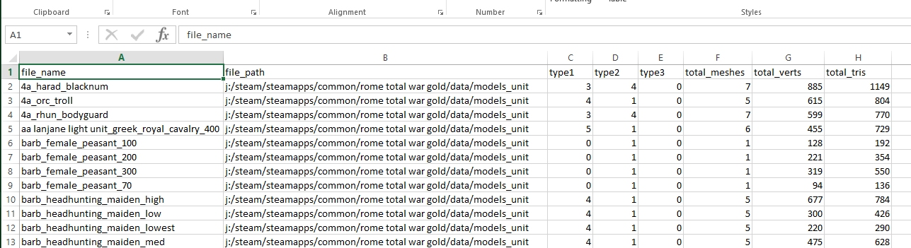
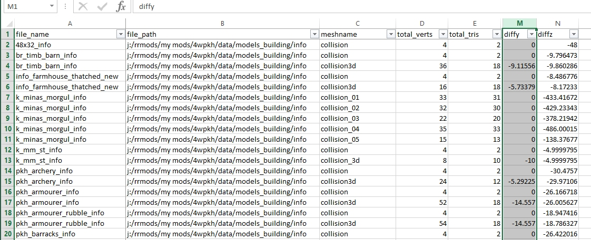

# Cas Checking Tasks
The cas checking tasks run through all the .cas files found in the specified directory and sub-directories and produce a csv file with summary information.  There are currently 3 different checks.
*  [cas_texture_csv](#cas_texture_csv) - to list all referenced .tga files
*  [cas_data_csv](#cas_data_csv) - to list numbers of meshes and total sizes
*  [cas_collision_csv](#cas_collision_csv) - to list names of meshes and check height difference across meshes
These processes must be run from a task file, they are not available via button functions.

For all the functions you can opt to include or exclude sub-directories.

## cas_texture_csv
**cas_texture_csv** is the task id needed to run the IWTE process that generates a .csv file listing all the textures named INSIDE the cas files, see [task file example](../task_file_examples/CAS_texture_tga_list_to_csv_task.txt).  

The csv file can be opened in a spreadsheet program such as Excel and the columns adjusted/filtered to enable you to find the information you need.

General Modding Points to Note:
* RTW and M2 will crash if the tga files specified inside cas models are not supplied
* texture.tga location is normally relative to the .cas file, e.g. in /textures folder below the .cas location
* if you have the .cas file in the mod-folder you also need its specified tga in the mod-folder regardless of whether it exists in vanilla/data 
* RR generally does not crash if tga files are missing but will display the object in bright pink instead
* textures are always referred to as *image_name.tga* even if the file finally used is a dds called *image_name.tga.dds*
* where tga.dds files are used you may also have to supply a same named .tga file to avoid crashes in RTW and M2

### Changing texture names inside .cas files
The texture names inside cas files may be changed by converting to 3d extract and modifying in Blender before converting back to .cas. Texture names can also be changed via IWTE screen. Some modders have changed texture names manually either via text or hex editor, neither is recommended especially if the change will alter the length of the name/path.

See [strat_models.md#cas-texture-names](strat_models.md#cas-texture-names)

## cas_data_csv
**cas_data_csv** is the task id needed to run the IWTE process that generates a .csv file listing summary data for multiple cas files, see [task file example](../task_file_examples/CAS_data_to_csv_task.txt).  

The csv file can be opened in a spreadsheet program such as Excel and the columns adjusted/filtered to enable you to find the information you need. High numbers of total verts and/or total tris can cause problems depending on the game and use of the cas file. The 'type' columns indicate the type of cas chunk each mesh inside the cas is written as, they work as follows:
* type 1 = not assigned to a bone, e.g. a static mesh - assigned to only one bone, e.g. RTW/RR primary_weapon
* type 2 = mesh assigned across multiple bones, but each vertex assigned 100% to 1 bone, e.g. M2TW strat characters
* type 3 = individual vertexes in the mesh assigned to 2 bones at variable % weighting, e.g. RR polysurface meshes and some RTW shoulderpad sections

## cas_collision_csv
**cas_collision_csv** is the task id needed to run the IWTE process that generates a .csv file listing information about cas files used for building collisions in RTW/RR, see [task file example](../task_file_examples/CAS_collision_to_csv_task.txt).  

The csv file can be opened in a spreadsheet program such as Excel and the columns adjusted/filtered to enable you to find the information you need. The important points to check are that the mesh names are correct, e.g. starting collision, collision3d or collision_3d.  AND that any mesh named collision (but not 3d or _3d) is FLAT, a variety of statistics about the meshes are shown in the csv file, but the one you need to check is that for the flat collision the 'diff y' column value is 0.  

The flat 'collision' meshes are used for pathfinding purposes on the battle-map, having a 3d mesh labelled as the collision has been found to cause CTDs in battle.

