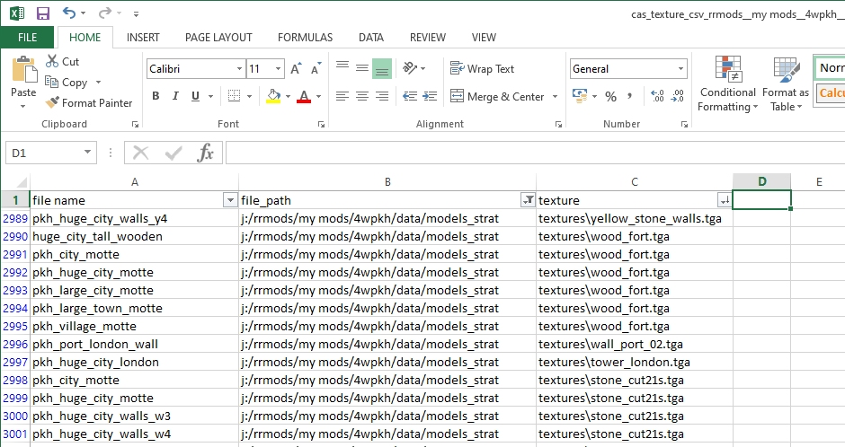

# cas_texture_csv

**cas_texture_csv** is the task id needed to run the IWTE process that generates a .csv file listing all the textures named INSIDE the cas files, see [task file example](../task_file_examples/CAS_texture_tga_list_to_csv_task.txt).  The process must be run from a task file it is not available via button functions.

The csv file can be opened in a spreadsheet program such as Excel and the columns adjusted/filtered to enable you to find the information you need.

