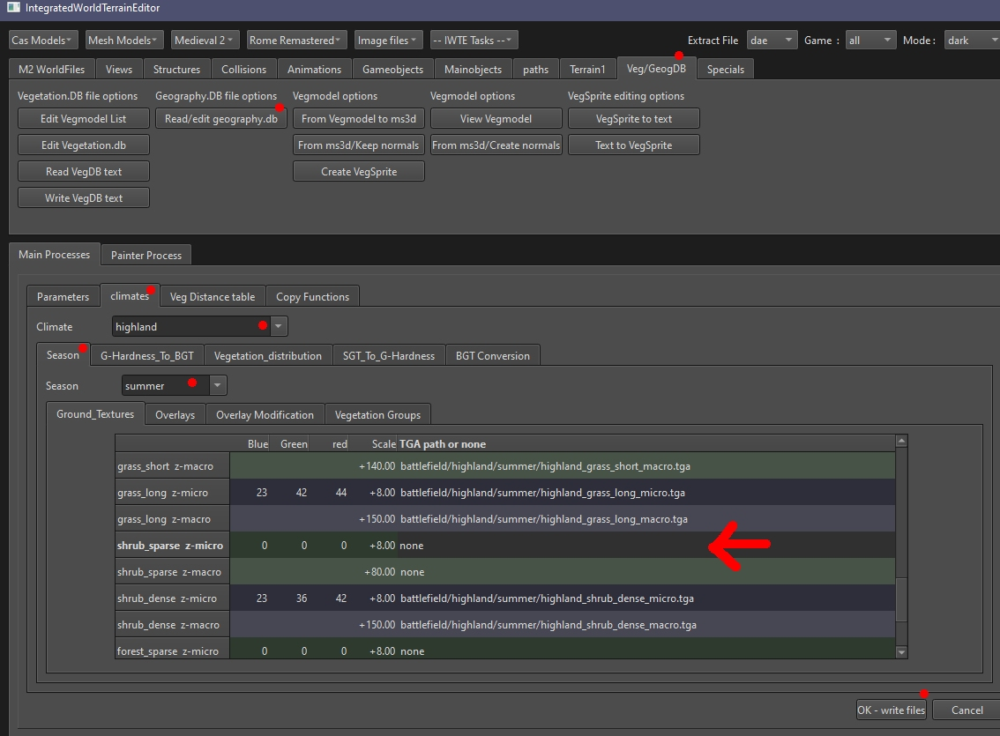
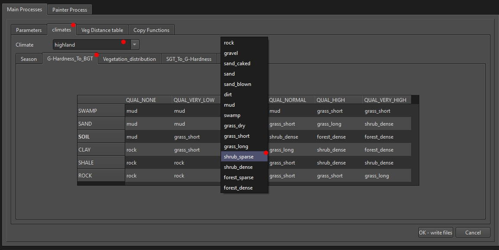
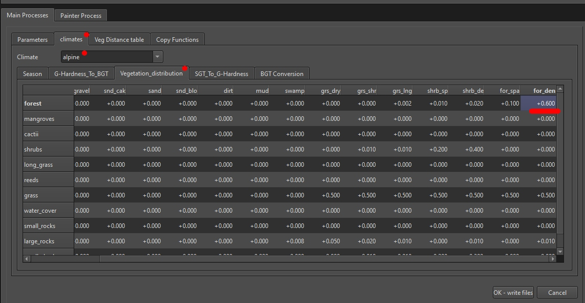

# Geography DB files in RTW and M2TW

M2TW has a *descr_geography_new.db* file which can be regenerated from *descr_geography_new.txt*.  RTW and RR have a *descr_geography.db* file which cannot be regenerated in game.  The M2TW has slightly more information and options than the RTW/RR one.  Both versions of the db can be edited in IWTE.

See also:
* [Muizer's Guide to battlemap modification](https://www.twcenter.net/forums/showthread.php?55785-Muizer-s-guide-to-battlemap-modification) - to understand the db

## Editing geography db files in IWTE

Use screen/button ***Veg/GeogDB > Read/edit geography.db*** to open a .db file.

Battlefield ground textures can be set in the *climates* tab, select the climate and season you want to work on.

Textures are listed against **battlemap** ground_type, these are different from the campaign map ground_types.

The image above shows an M2TW geography.db file, M2 has an additional line for each texture as it uses both a micro and macro texture.

You can add textures to ground_types that are currently listed as 'none', however they won't appear unless you also amend the *G-Hardness_To_BGT* table, see below:

You can click on one of the boxes to activate the drop down and select a different ground_type for each intersection of 'Hardness' and 'Quality'.

### Getting from campaign ground_type to battle ground_type

### M2 specific elements

M2TW has the ability to regenerate the geography db file from the text file however this process wipes out all the distance colour values and can also cause memory problems as ALL the battlemap textures are read and held in memory.

The M2TW geography db has set-able options for the density of the individual vegetation types per battlemap ground-type.

Be conservative when setting amounts of vegetation to add.  In the image above you can see the 0.6 value that is set in vanilla M2 for forest trees on forest_dense section of the alpine climate.  This setting tends to produce battlemaps with dense tree areas that flicker on and off due to graphics overload!
