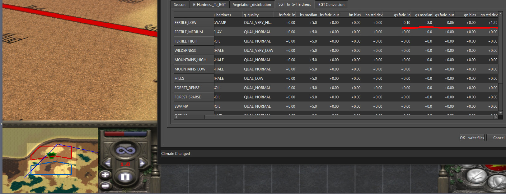

# Geography DB files in RTW and M2TW

M2TW has a *descr_geography_new.db* file which can be regenerated from *descr_geography_new.txt*.  RTW and RR have a *descr_geography.db* file which cannot be regenerated in game.  The M2TW has slightly more information and options than the RTW/RR one.  Both versions of the db can be edited in IWTE.

See also:
* [Muizer's Guide to battlemap modification](https://www.twcenter.net/forums/showthread.php?55785-Muizer-s-guide-to-battlemap-modification) - to understand the db

## Editing geography db files in IWTE

Use screen/button ***Veg/GeogDB > Read/edit geography.db*** to open a .db file.

Battlefield ground textures can be set in the *climates* tab, select the climate and season you want to work on.

Textures are listed against **battlemap** ground_type, these are different from the campaign map ground_types.

The image above shows an M2TW geography.db file, M2 has an additional line for each texture as it uses both a micro and macro texture.

You can add textures to ground_types that are currently listed as 'none', however they won't appear unless you also amend the *G-Hardness_To_BGT* table, see below:

You can click on one of the boxes to activate the drop down and select a different ground_type for each intersection of 'Hardness' and 'Quality'.

## Getting from campaign ground_type to battle ground type

You'll have noticed from the texture list that the available 'ground_types' on the battle-map are different from the strat-map types.  The SGT_To_G-Hardness gives settings for each strat-map ground_type including selections for a g-hardness and g-quality combination.  These settings affect where in the G-Hardness_to_BGT table that strat-map ground type will start to look for battle-map textures.  In the picture below you see that a fertile_medium pixel on map_ground_types.tga will trigger the battle map to use Shale/Qual_Normal, looking at the intersection of the Shale and Qual_Normal row/column you'll see that gives 'grass_dry'.  However that is just the starting point, other influences on the battle-map such as height/slope or proximity to water will affect which battle ground type is actually used.

## Battle ground type variation

The variability settings for each strat ground type affect the extent to which adjacent battle ground types are mixed in.  These experiments use a flat battle-map on the coast where height variations and biases have been removed from the climate's height section, all land pixels of the strat map surrounding the area use the same climate and fertile_low ground_type.  Brightly coloured textures with the BGT name written in are used for easy identification.

Fertile Low has been set to start at Swamp/Qual_Very_High, which is the only segment using 'sand' (the yellow colour).  Inspection of the map shows shrub_dense, mud and gravel are also being used.

These are the variability settings used in conjunction with the above table:

Changing the fertile_low ground type variability settings all to 0 gives a map that is purely using the sand ground type, except along the shore line where the slope is using mud and gravel.

Experimenting by changing just the gs_median values give the results shown for the values 7,8,9,10 and 15, values of 6 and below seemed to remove all variation.

Experimenting with gn_std_dev gave similar results, very low values switched off variation, values >10 gave a more speckled appearance.  Neither experiment changed which battle ground types were selected for the mix.

Fade-in/out is difficult to understand, and needs work!!!!

Experimenting with gn_bias doesn't seem to do anything in M2, and also seems to be set at 0.0 for all vanilla entries

## M2 specific elements

M2TW has the ability to regenerate the geography db file from the text file however this process wipes out all the distance colour values and can also cause memory problems as ALL the battlemap textures are read and held in memory.

The M2TW geography db has set-able options for the density of the individual vegetation types per battlemap ground-type.

Be conservative when setting amounts of vegetation to add.  In the image above you can see the 0.6 value that is set in vanilla M2 for forest trees on forest_dense section of the alpine climate.  This setting tends to produce battlemaps with dense tree areas that flicker on and off due to graphics overload!

