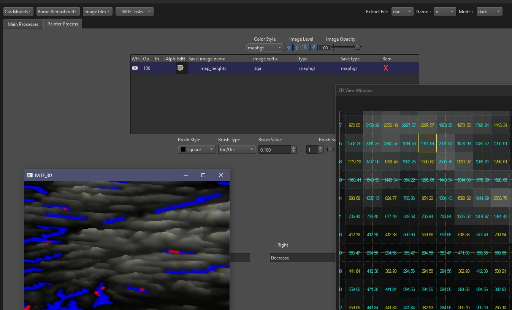

# Strat Map Editing with IWTE

To open the map_*.tga files used in RTW/RR/M2TW maps in IWTE use the buttons  
**Image Files > Strat Mapping Files > Map *Name***

The various options for Map Heights will allow you to load an .hgt file and convert to .tga or vice versa. 

Editing as .hgt shows the height values as 'actual heights' instead of the 0-255 range given in .tga mode.  The heights are calculated on the basis of using the normal descr_terrain.txt values   
> min_sea_height  -3406.782  
>	max_land_height  7511.272
A 3d representation of the heights will be shown in the 3d window.
Red colours on the 2d and 3d map heights representation indicate RGB 0,0,0 - you are free to use that value, but be aware that although it will look like land on your heights map the game will treat it as sea for pathfinding purposes.

Manipulating the opacity and order of map images you have loaded will allow you to see how the files interact.  Each region 'pixel' will overlap one central pixel of map_heights/climates/ground_types, this central pixel will control the accessibility and climate of that region pixel in game.  The region pixel will also overlap 8 map_heights/climates/ground_types around the perimeter, these pixels add detail to the campaign map and battle map but do not affect pathfinding.
