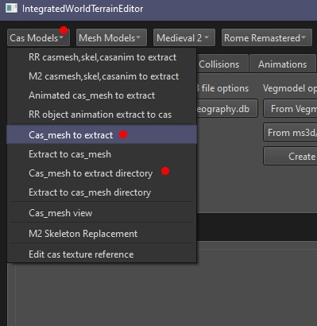
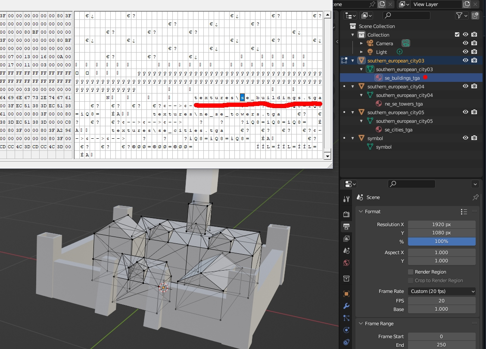
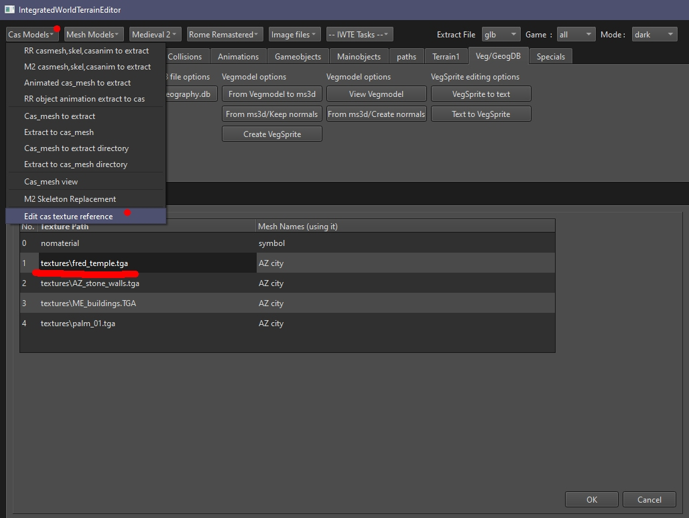
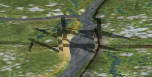

# Strat Models (static)

General Modding Points to Note:
* Static strat models used on the campaign map in RTW, RR and M2TW are all in the same .cas format.
* The textures used for each mesh are specified INSIDE the .cas file and not in external text files.
* Failing to include the correctly named .tga file can cause the game to crash on campaign load (except in RR where the missing texture will be rendered as pink).
* If the model .cas in a mod-folder uses a vanilla texture, that .tga must be added to the mod-folder.
* Textures can additionally be supplied as dds files named .tga.dds, this allows user manipulation of the mip-maps and smaller file sizes.  A .tga with the correct name should still be supplied, but this can just be 1px size.
* See [Strat Models - M2TW](https://wiki.twcenter.net/index.php?title=Strat_Models_-_M2TW) on the TWC Wiki for some additional information.

#### Table of Contents
* [cas_to_extract](#cas_to_extract)
* [Cas Texture Names](#cas-texture-names)
* [Residences](#residences)
* [Bridges](#bridges)
  
## cas_to_extract

The task id you need to convert static cas models to dae/glb/ms3d is **cas_to_extract**, see [task file example](https://github.com/makanyane/IWTE/blob/main/task_file_examples/CAS_cas_to_extract_no_anim_task.txt).

This process can also be accessed from buttons *Cas Models > Cas_mesh to extract*, see picture below

When using the buttons the type of extract (dae/glb/ms3d) will be set by the Extract File type currently selected.
The *Cas_mesh to directory* button performs a similar conversion of all the cas files in a directory.  The task ID for that function is **cas_to_extract_directory** and will need a **<directory_in>** specified, see [task file example](../task_file_examples/CAS_cas_to_extract_directory_task.txt).

## Cas Texture Names

Each mesh in a .cas file can have only one texture assigned. IWTE uses the material name to set the texture name, e.g. in the picture below a material name of *se_buildings_tga* sets a texture name of *textures\se_buildings.tga* when converted back to .cas

This allows you to view the model in Blender with differently named textures without affecting the texture assignment.

If you need to check or change a cas files textures without converting it you can use *Cas Models > Edit cas texture reference*

Change the path/name you want to alter and click OK.  The revised file will be saved in a folder called *amended* e.g.\
*original_folder/amended/original_name.cas*\
copy/move it to replace the original cas if you are happy with the changes.

To check which texture names are referenced by ALL the .cas files in a folder or mod use the [cas_texture_csv](cas_checking_tasks.md#cas_texture_csv) function.

## Residences

Campaign map settlement models are normally referred to as 'residences' and found in data/models_strat/residences.

General Modding Points to Note:
* RTW and RR settlements have the 'city' element in a different .cas file to the 'wall' elements as walls can be upgraded separately.
* M2TW settlements can have 'faction_variants'
  * More than 65 valid named faction variants models causes a crash on exit
  * Too high a total volume of triangles across all settlement models can cause shadows to stop being rendered
* RTW and M2TW residences are specified in descr_cultures.txt
* RR residences are specified at the top of each settlement_plan text file
* Residence models have a 'symbol' mesh which controls the strat flag position, this mesh should NOT have a texture
* Models with too many triangles or vertexes can cause crashes
* RTW and M2TW residences can have some triangles that face away from the camera removed to reduce size.  RR residences can be viewed from any angle.

## Bridges

### Bridges in M2TW
Bridge models in M2TW are revolved to either 0,90,180,270 degrees to suit river direction.  However the shadow rendered by the bridge is only based on the 0 or 90 degree version, therefore having a non-symmetrical bridge model will give you odd shadows, see example picture below.

The MESH NAME is also important e.g. the mesh name inside *bridge_dirt.cas* must be *bridge_a* otherwise only the shadow is displayed!

### Bridges in RR
The displayed height of the bridge models on the RR campaign map is set by the campaign's map_heights.tga/hgt\
This may be a problem as the height of everything else on the campaign map is set by the mesh itself and the heightmap .bin files which are based on the mesh...

Therefore please do not attempt to use a mesh that varies substantially from the games expected heights at bridge positions.

