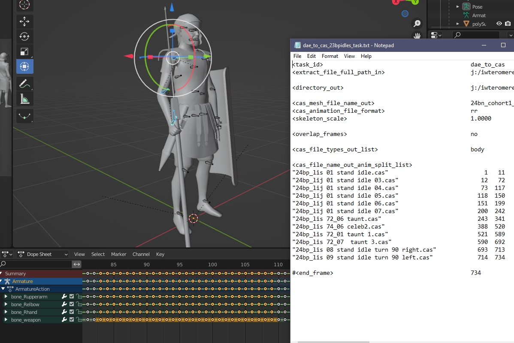
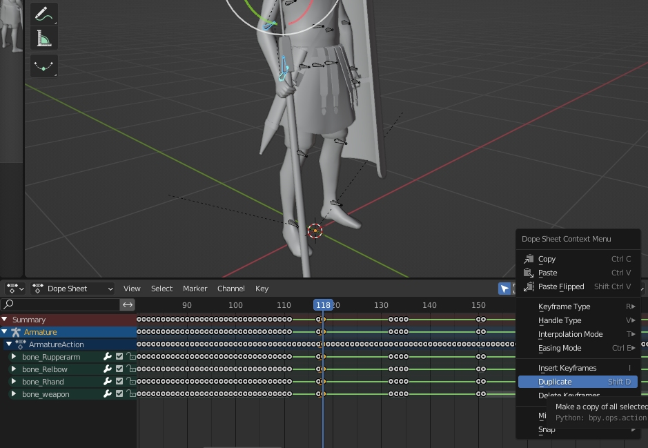

# Editing unit animations in Blender

## Aligning start and end poses in animations
In M2TW and RR/RTW a lot of animations need to start and/or end with the same pose to avoid unpleasant glitches in game.  For example the main idle variants will share the same pose with the start of stand_to_run and the end of walk_to_stand.

Add multiple animations that you need to coordinate to your mesh/cas_to_extract task file and run that through IWTE.  View the return task that IWTE writes to see where the individual animations start and end, and load the extract file in Blender:

In pose mode in the animations window of Blender, select the bones you want to adjust and delete any unwanted keyframes for those bones between the start/end frames.

Select or set positions/rotations for the bones you're adjusting at one relevant keyframe point. When you're happy with that pose duplicate the positions by selecting the column of the keyframe, right-click, duplicate, and drag to the keyframe where you want the pose to be the same, e.g. for this example the start and end of all idles, and the parts where the unit starts/ends at 'stand'.

For movements between the start/end points you don't need to fill in all the keyframes, just set frames for the maximum/minimum movement points and anything that needs precision adjustment.
